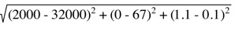
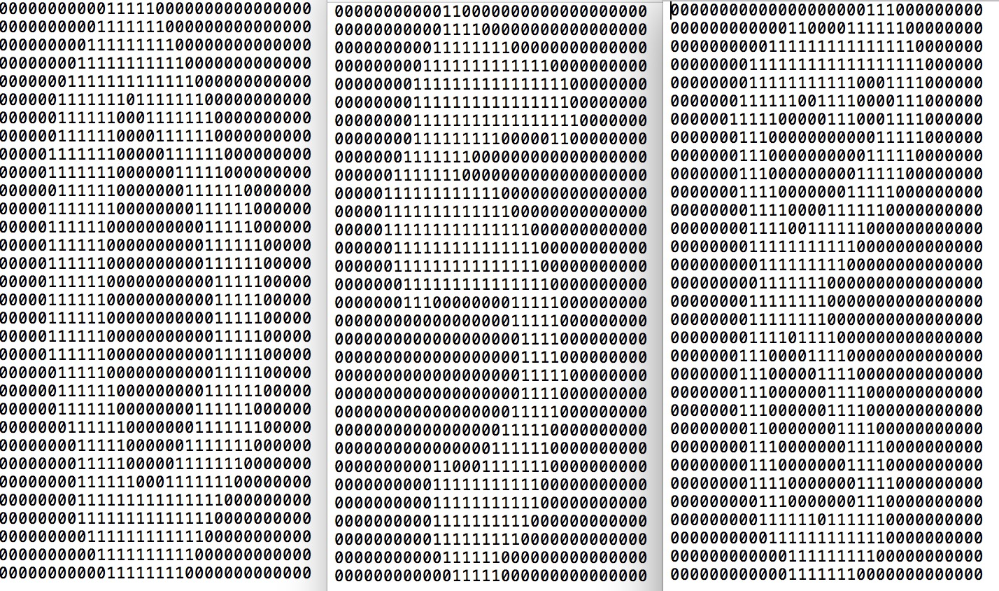

第2章 K-近邻算法（KNN）
==================
# 1 工作原理与流程：
KNN算法采用 **测量不同特征值之间的距离** 进行分类。

- 准备训练样本集，要求每条记录都打好标签（提前分好类）；
- 输入无标签的数据，计算输入与样本集中每条记录的距离；
- 距离排序，选取k个最近邻的数据记录与其标签；（k通常选不大于20的整数）
- k个选取标签中出现次数最多的即为输入数据的分类标签。

**优点**：精度高、对异常值不敏感、无数据输入假定。

**缺点**：计算复杂度高、空间复杂度高。

**适用数据范围**：数值型与标称型。

___
# 2 案例说明
## 2.1 案例一、约会预测
海伦共收集约会网站上1000条数据，其中每个数据包含3种特征
- 每年获得的飞行里程数
- 玩视频游戏所花费时间百分比
- 每周消费的冰淇淋公升数

海伦将这1000条数据分别进行标记，是否为自己喜欢的类型。所有特征与标签数据都存放在datingTestSet.txt文件中。

交往过的3种标记类型：
- 不喜欢的人
- 魅力一般的人
- 极具魅力的人

### 2.1.1 从文本中读取并解析数据
```python
def file2matrix(filename):
    '''
    从文件filename中读取约会数据样本，并返回样本数据与标签
    '''
    returnMat = []
    returnLabel = []
    lable = {'didntLike':1, 'smallDoses':2, 'largeDoses':3}
    with open(filename, 'r') as fp:
        lines = fp.readlines()
        returnMat = np.zeros((len(lines), 3)) #定义一个(len(lines), 3) 2维数组并填充0
        '''
        这里使用zeros初始化全是0是二维数组的好处是，np会默认将从文件读取的字符串转化成float, 不用在代码里显示转换
        '''
        index = 0
        for line in lines:
            listFromLine = line.strip().split('\t')
            returnMat[index,:] = listFromLine[0:3]
            returnLabel.append(lable[listFromLine[-1]] if listFromLine[-1] in lable else 1)
            index +=1
        returnMat = np.array(returnMat)
            
    return returnMat , returnLabel
```
代码中并没有显示的将文件中的字符串转换成二组数组中的int或float，而是通过zeros初始化一个数组，并指定数值类型。由numpy在内部进行类型转化。

测试文件解析
```python
>>> datingDataMat , datingLabels = file2matrix("datingTestSet.txt")
>>> datingDataMat
    array([[  4.09200000e+04,   8.32697600e+00,   9.53952000e-01],
        [  1.44880000e+04,   7.15346900e+00,   1.67390400e+00],
        [  2.60520000e+04,   1.44187100e+00,   8.05124000e-01],
        ..., 
        [  2.65750000e+04,   1.06501020e+01,   8.66627000e-01],
        [  4.81110000e+04,   9.13452800e+00,   7.28045000e-01],
        [  4.37570000e+04,   7.88260100e+00,   1.33244600e+00]])
>>> datingDataMat.dtype
    dtype('float64')
>>> datingDataMat.shape
    (1000, 3)
>>> datingLabels[0:20]
    [2, 1, 0, 0, 0, 0, 2, 2, 0, 2, 0, 0, 1, 0, 0, 0, 0, 0, 1, 2]

```

### 2.1.2 分析数据: 使用Matplotlib创建散点图

游戏时间与冰淇淋 两维度的输出图像
```python
    import matplotlib.pyplot as plt
    
    fig = plt.figure()
    ax = fig.add_subplot(111)
    ax.scatter(datingDataMat[:,1], datingDataMat[:,2], 15.0*np.array(datingLabels), 15.0*np.array(datingLabels))
    plt.show()
```


飞行里程与游戏时间 两维度的输出图像
```python
    import matplotlib.pyplot as plt
    
    fig = plt.figure()
    ax = fig.add_subplot(111)
    ax.scatter(datingDataMat[:,0], datingDataMat[:,1], 15.0*np.array(datingLabels), 15.0*np.array(datingLabels))
    plt.show()
```


对比第一张图，第二张图明显可以进行类型区别。说明飞行里程与游戏时间这两个特征对于分类效果更好。

### 2.1.3 准备数据： 归一化数值
选取如下4个样本
 id | 每年获得的飞行里程数 | 玩视频游戏所花费时间百分比 | 每周消费的冰淇淋公升数 | 样本分类 
 --- | ---------------- | --------------------  | ------------------- | ------
 1   |     400          |      0.8              |       0.5           |   1
 2   |     134 000      |      12               |       0.9           |   3
 3   |     20 000       |      0                |       1.1           |   2
 4   |     32 000       |      67               |       0.1           |   2
 
 当计算样本3与样本4之间的距离时
 
 
 
很容易看出，上面方程中数字差值最大的属性对计算结果影响最大。也就是说每年获得的飞行里程数对结果影响最大，为了保证三个特征的权重相同，可以先将数值归一化，都转换到0到1或-1到1之间
```
    newvalue = (oldvalue - mim) / (max - mim)
    其中mim与max分别是数据集中的最小特征值和最大特征值。
```
因此我们定义一个归一化函数autoNorm()
```python
def autoNorm(dataSet):
    '''
    针对样本数据归一化，减小不同属性数据单位不一致，导致权重问题
    '''
    mimVal = dataSet.min(0) 每列的最小值
    maxVal = dataSet.max(0) 每列的最大值
    ranges = maxVal - mimVal
    normDataSet = np.zeros(dataSet.shape)
    
    normDataSet = dataSet - np.tile(mimVal, (dataSet.shape[0], 1))
    normDataSet = normDataSet / np.tile(ranges, (dataSet.shape[0], 1))
    
    
    return normDataSet, ranges, mimVal, maxVal
```

### 2.1.4 测试算法： 验证算法的正确率
机器学习算法一个重要工作就是评估算法的正确率，通常我们只提供已有数据的90%作为训练样本来训练分类器，而使用其余的10%数据去测试分类器的正确率。** 错误率 **就是分类器给出错误结果的次数除以测试数据的总数，完美的分类器错误率为0，而错误率的1的分类器不会给出任何正确的分类结果。
```python
def datingClassTest():
    '''
    测试约会KNN算法在此样本下的正确率。使用90%的总样本作为训练样本，其余10%用于评估算法的正确率
    '''
    hoRatio = 0.05
    datingDataMat , datingLabels = file2matrix("datingTestSet.txt")
    datingDataMat, ranges, mimVal, maxVal = autoNorm(datingDataMat)
    numTestVecs = int(hoRatio * datingDataMat.shape[0])
    errorCount = 0.0
    
    for i in range(numTestVecs):
        classifyResultLabel = classify0(datingDataMat[i,:], datingDataMat[numTestVecs:datingDataMat.shape[0],:], datingLabels[numTestVecs:datingDataMat.shape[0]], 10)
        print 'the classify came back with: %d, the real answer is : %d' % (classifyResultLabel, datingLabels[i])
        if (classifyResultLabel != datingLabels[i]) : errorCount += 1.0
    print 'the total error rate is : %f' % (errorCount/float(numTestVecs))
    
    
>>> datingClassTest()
the classify came back with: 3, the real answer is : 3
the classify came back with: 2, the real answer is : 2
the classify came back with: 1, the real answer is : 1
the classify came back with: 1, the real answer is : 1
....
the classify came back with: 1, the real answer is : 1
the classify came back with: 1, the real answer is : 1
the classify came back with: 1, the real answer is : 1
the classify came back with: 2, the real answer is : 2
the total error rate is : 0.020000  错误率为2%
```
可通过调整 hoRatio检测样本占有率 和 变量k ，查看最终错误率的变化情况。


### 2.1.5 使用算法： 构建完整可用的系统
输入想要测试者的特征，使用knn计算分类结果
```python
def classifyPersion():
    '''
    命令行输入待预测的数据，输出预测结果。
    '''
    resultList = ['not at all', 'in small doses', 'in large doses']
    
    percentTats = float(raw_input('percentage of time spent playing video games?'))
    ffMiles = float(raw_input('frequent flier miles earned per year?'))
    iceCream = float(raw_input('liters of ice cream consumed per year?'))
    
    datingDataMat , datingLabels = file2matrix("datingTestSet.txt")
    datingDataMat, ranges, mimVal, maxVal = autoNorm(datingDataMat)
    
    inArr = np.array([percentTats, ffMiles, iceCream])
    inArr = (inArr - mimVal)/ranges
    
    classifyResultLabel = classify0(inArr, datingDataMat, datingLabels, 10)
    print 'You will probably like this person: ', resultList[classifyResultLabel]
    
    
>>> classifyPersion()
percentage of time spent playing video games?12
frequent flier miles earned per year?5600000
liters of ice cream consumed per year?5
You will probably like this person:  in small doses
```


## 2.2 案例二、 手写识别系统
构造使用Knn分类算法的手写识别系统，为了简单起见，系统只能识别0-9的数字。另外需要识别的数字已使用图形处理软件，处理成具有相同的色彩和大小：32 * 32 像素的黑白图像，同时采用文本格式存储图像（浪费存储空间）.

### 2.2.1 准备数据：将图像转换成测试向量
目录trainingDigits中包含大约2000个例子，每个数字大约200个样本，作业训练样本；

目录testDigis中包含大约900个测试数据，用于检验训练样本产生的模型的正确率。两组数据没有重叠。


为了直接使用前面的分类器，我们将图像格式化处理为一个向量（32*32的二进制图像矩阵转换为1*1024的向量）。
先编写将图像转换成向量的函数img2vector：该函数创建1*1024的Numpy数组，然后打开给定文件，循环读取文件的前32行，并将每行的头32个字符存储在Numpy数组中，最后返回数组。
```python
def img2vector(filename):
    '''
    图像转换成向量的函数img2vector：该函数创建1*1024的Numpy数组，然后打开给定文件，循环读取文件的前32行>，并将每行的头32个字符存储在Numpy数组中，最后返回数组。
    '''
    returnVect = np.zeros((1,1024))
    with open(filename, 'r') as fp:
        index = 0
        for line in fp.readlines():
            line = line.strip()
            returnVect[0,index*32 : (index+1)*32] = list(line)
            index +=1
    return returnVect


>>> returnVect = img2vector('trainingDigits/8_60.txt')
>>> returnVect[0, 0:32]
array([ 0.,  0.,  0.,  0.,  0.,  0.,  0.,  0.,  0.,  0.,  0.,  0.,  0.,
        0.,  1.,  1.,  1.,  1.,  1.,  0.,  0.,  0.,  0.,  0.,  0.,  0.,
        0.,  0.,  0.,  0.,  0.,  0.])
>>> returnVect[0, 32:64]
array([ 0.,  0.,  0.,  0.,  0.,  0.,  0.,  0.,  0.,  0.,  0.,  0.,  0.,
        1.,  1.,  1.,  1.,  1.,  1.,  1.,  0.,  0.,  0.,  0.,  0.,  0.,
        0.,  0.,  0.,  0.,  0.,  0.])

```

### 2.2.2 测试算法： 使用K-近邻算法识别手写数字
在代码头部添加代码from os import listdir, listdir用于获取目录下的所有文件,并返回一个包含文件名的list对象。由于在mac os下测试此代码，因mac 默认每个目录下都存在'.DS_Store'文件，所以得先删除。

```python
def handwritingClassTest():
    hwLables = []
    trainingFileList = listdir('trainingDigits')
    
    #删除非测试文件，因为mac os所有目录中都存在'.DS_Store'文件
    for filename in trainingFileList:
        if filename.endswith('.txt'):
            continue
        else:
            trainingFileList.remove(filename)
            
    m = len(trainingFileList)
    trainingMat = np.zeros((m,1024))
    
    for i in range(m):
        filename = trainingFileList[i]
        hwLables.append(filename.split('_')[0])
        trainingMat[i,:] = img2vector("trainingDigits/" + filename)
        
    testFileList = listdir('testDigits')
    testFileList.remove('.DS_Store')
    
    errorCount = 0.0
    for testfile in testFileList:
        testMat = img2vector('testDigits/' + testfile)
        testLabel = testfile.split('_')[0]
        classifyResultLabel = classify0(testMat, trainingMat, hwLables, 10)
        
        print 'the classify Result is %s ,and the true label is %s.', (classifyResultLabel, testLabel)
        if classifyResultLabel != testLabel :
            errorCount +=1
            
    print "the total number of errors is : %d" % errorCount
    print "the total error rate is : %f" % (errorCount/float(len(testFileList)))


#部分输出信息,可以看出错误率只有2.1%:
>>> handwritingClassTest()
the classify Result is %s ,and the true label is %s. ('0', '0')
the classify Result is %s ,and the true label is %s. ('0', '0')
the classify Result is %s ,and the true label is %s. ('0', '0')
the classify Result is %s ,and the true label is %s. ('0', '0')
the classify Result is %s ,and the true label is %s. ('0', '0')
...
the classify Result is %s ,and the true label is %s. ('9', '9')
the classify Result is %s ,and the true label is %s. ('9', '9')
the classify Result is %s ,and the true label is %s. ('9', '9')
the classify Result is %s ,and the true label is %s. ('9', '9')
the classify Result is %s ,and the true label is %s. ('9', '9')
the total number of errors is : 20
the total error rate is : 0.021142
```
由于图片样本文件中的值都已经在0和1之间，本测试程序并不用使用autoNorm函数进行归一化。
实际在使用这个算法时，算法的执行效率并不高。因为算法要为每个测试向量做2000次距离计算，每个距离计算包括了1024个维度浮点运算，总计要执行900次。此外，我们还要为测试向量准备2MB的存储空间。

是否存在一种算法减少存储空间和计算时间的开销呢？

**K决策树** 就是k- 近邻算法的优化版，可以节省大量的计算开销。

K近邻算法另一个 **缺陷** 是无法给出任何数据的基础结构信息，因些无所知晓平均实例样本和典型实例样本具有什么特征。


### 参考
[Numpy使用中文教程](http://old.sebug.net/paper/books/scipydoc/numpy_intro.html)

[Numpy使用英文教程](https://docs.scipy.org/doc/numpy/reference/)


