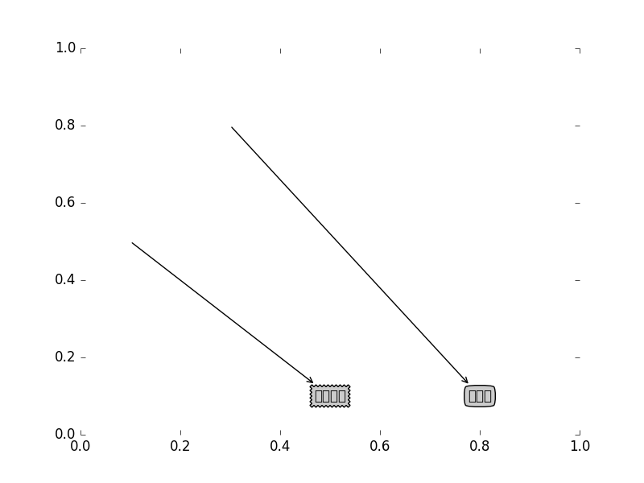
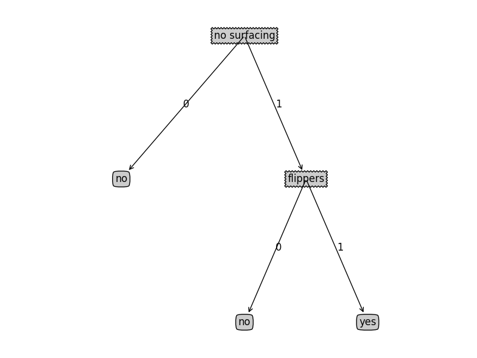

第三章 决策树
=================

# 1 工作原理与流程
决策树原理类似于20个问题的游戏。规则很简单：参与游戏的一方确定一个事物，其他参与者向他提问，只允许提20个问题，问题的答案只能用对与错回答。问问题的人通过推断分解，逐步缩小待猜测事物的范围。

决策树的一个重要任务是为了数据中所蕴含的知识信息，因此决策树可以使用不熟悉的数据集合，并从中提取出一系列规则。**根据数据集创建规则的过程**，就是机器学习的过程。专家系统中经常使用决定树，而且决策树给出的结果往往可以匹敌在当前领域具有几十年工作经验的人类专家。

**优点**： 计算复杂度不高，输出结果易于理解，对中间值的缺失不敏感，可以处理不相关特征数据。

**缺点**： 可能会产生过度匹配问题。

**适用数据范围**：数值型与标称型。

_________________
# 2 决策树的构造

### 如何从一堆原始数据中构造决策树？

- 当前数据集上哪个特征在划分数据分类时起决定性作用或作用最大？必须评估每个特征，找出决定性最好的特征。
- 根据特征划分为几个数据子集（不同分支下）。如果某个分支下的数据属于同一类型，则不用再细分。若数据子集内的数据不属于同一类型，则重复第一步选择决定性最好的特征，直到所有具有相同类型的数据均在一个数据子集内。

**创建分支的伪代码createBranch()如下：**

```code

检测数据集中的每个子项是否属于同一分类：
	IF SO RETURN 类标签；
	ELSE：
		寻找划分数据集的最好特征
		划分数据集
		创建分支节点
		FOR 每个划分的子集
			调用函数createBranch()并增加返回结果到分支节点中
		RETURN  分支节点

```
一般的决策树采用二分法划分数据，但本书不使用这种方法。如果依据某属性划分数据将会产生4个可能的值，则我们将数据划分成4块，并创建4个不同的分支。本书使用ID3算法划分数据集，参考[ID3算法介绍](https://en.wikipedia.org/wiki/ID3_algorithm)

测试数据包含5个海洋生物，特征包括不浮出水面是否可以生存与是否有脚蹼。我们将这些动物分成两类：鱼类、非鱼类。

** 海洋生物数据**

id   | 不浮出水面是否可以生存 | 是否有脚蹼 | 是否属于鱼类  
 --- | ---------------------- | ---------  | ------------------- 
 1   |           是           |      是    |       是           
 2   |           是           |      是    |       是           
 3   |           是           |      否    |       否            
 4   |           否           |      是    |       否            
 5   |           否           |      是    |       否            

## 2.1 信息增益

划分数据集的**最大原则**是：将无序的数据变得更加有序。在划分数据集之前之后信息发生的变化称为**信息增益(information gain)**，知道如何计算信息增益，我们就可以计算每个特征值划分数据集获得的信息增益，获得信息增益最高的特征就是最好的划分选择。

集合信息的度量方式称为**香农熵或者熵(entropy)**. **熵定义为信息的期望值**。如果待分类的事物可能划分在多个分类之中，则符号$x_i$的信息定义为

$$l\left(x_i\right)=-log_2p\left(x_i\right)$$

其中$p(x_i)$是选择该分类的概率

为了计算熵，我们要计算所有类别所有可能值包含的信息期望值，通过下面公式得到：

$$H=-\sum_{i=1}^{n}{p(x_i)log_2p\left(x_i\right)}$$

其中n是分类的数目。

下面使用Python计算信息集的信息熵：
```python
from math import log
def calcShannonEnt(dataset):
    '''
    计算dataset数据集的熵（香农，信息熵）
    '''
    numEntries = len(dataset)
    labelCounts = {}
    
    for featVec in dataset:
        label = featVec[-1]
        if label not in labelCounts.keys():
            labelCounts[label] = 0
        
        labelCounts[label] +=1
            
    shannonEnt = 0.0
    for label in labelCounts:
        prob = float(labelCounts[label]) / numEntries #使用所有类标签的发生频率计算类别出现的概率
        shannonEnt -= prob * log(prob, 2)
        
    return shannonEnt
```

代码非常简单，其中prob为某一标签出现的次数除以总数据集的大小，也就是此标签出现的概率。

创建简单的鱼鉴定数据集：

```python
def createDataset():
    dataSet = [[1, 1, 'yes'],
               [1, 1, 'yes'],
               [1, 0, 'no'],
               [0, 1, 'no'],
               [0, 1, 'no'],
               ]
    labels = ['no surfacing', 'flippers']
    
    return dataSet, labels
```

计算鱼鉴定数据集的信息熵：如下增加第三个maybe分类,信息熵由0.97增加到1.37。因此熵越高，则混合的数据也越多。

```python
>>> myDat, labels = createDataset()
>>> print calcShannonEnt(myDat)
0.970950594455
>>> myDat[0][-1] = 'maybe'
>>> print myDat
[[1, 1, 'maybe'], [1, 1, 'yes'], [1, 0, 'no'], [0, 1, 'no'], [0, 1, 'no']]
>>> print calcShannonEnt(myDat)
1.37095059445
```

另一个度量集合无序程序的方法是**基尼不纯度（Gini impurity）**,也就是从一个数据集中随机选取子项，度量其被错误分类到其他分组里的概率。本书暂时不介绍。

## 2.2 划分数据集

上一节介绍了如何度量数据集的无序程序，分类算法除了需要测量信息熵，还需要划分数据集，度量划分数据集的熵，以便判断当前是否正确地划分了数据集。我们将每个特征划分数据集的结果都计算一次信息熵，然后判断按照哪个特征划分数据集是最好的划分方式。

按照特定的特征划分数据集:

```python
def splitDataSet(dataSet, axis, value):
    '''
    dataSet: 待划分的数据集
    axis： 数据集中的某一特征
    value： 特征某个取值
    
    返回数据集中特征axis值为value的子数据集
    '''
    retDataSet = []
    for featVec in dataSet:
        if featVec[axis] == value:
            reducedFeatVec = featVec[:axis]
            reducedFeatVec.extend(featVec[axis+1:])
            retDataSet.append(reducedFeatVec)
            
    return retDataSet
```

Python语言不用考虑内存分配的问题。Python语言在函数中传递是的列表的引用，在函数内部对列表对象的修改，将会影响该列表对象的整个生存周期。

测试划分数据集

```python
>>>  print splitDataSet(myDat, 0, 1)
[[1, 'yes'], [1, 'yes'], [0, 'no']]
>>> print splitDataSet(myDat, 0, 0)
[[1, 'no'], [1, 'no']]
```

接下来遍历整个数据集，循环计算香农熵和splitDataSet函数，找到最好的特征划分方式。熵计算会告诉我们如何划分数据集是最好的数据组织方式。

```python
def chooseBestFeatureToSplit(dataSet):
    '''
    循环计算信息熵，选择最优的划分方式
    '''
    numFeatures = len(dataSet[0]) -1 #最后一个属性是标签
    baseEntropy = calcShannonEnt(dataSet) #计算原始数据集的信息熵，此信息熵应是最大的
    bestFeatures = -1
    bestInfoGain = 0.0
    
    
    for i in range(numFeatures): #遍历所有特征
        featureValue = [feature[i] for feature in dataSet]
        uniqFeatureValue = set(featureValue)
        
        newEntropy = 0.0
        for value in uniqFeatureValue:
            subDataSet = splitDataSet(dataSet, i, value)
            prob = float(len(subDataSet)) / float(len(dataSet))
            newEntropy += prob * calcShannonEnt(subDataSet)
            
        infoGain =  baseEntropy - newEntropy
        
        if  infoGain > bestInfoGain:
            bestInfoGain = infoGain
            bestFeatures = i
            
    return bestFeatures


>>> print chooseBestFeatureToSplit(myDat)
0
```

## 2.3 递归构建决策树

**工作原理**如下：得到原始数据集，然后基于最好的属性值划分数据集，由于特征值可能多于两个，因此可能存在大于2个分支的数据集划分。第一次划分之后，数据将被向下传递到树分支的下一个节点，在这个节点上，我们可以再次划分数据。因此，使用递归的方式处理数据集。

**递归结束条件**是：程序遍历完所有划分数据集的属性，或者每个分支下的所有实例都属于同一个分类。对于数据集已经处理了所有属性，但类标签依然不是唯一的，我们通常会采用多数表决（出现次数最多的分类）的方式来决定该叶子节点的分类。

多数表决算法：选择出现次数最多的分类.先统计每个标签出现的次数，然后利用operator操作键值排序字典，最后返回次数最多的分类名称。

```python
def majorityCnt(classList):
    '''
    采用多数表决的方法决定该叶子节点的分类，即classList中出现次数最多的lable
    classList: 划分后的子数据集的标签集合
    '''
    classCount = {}
    for vote in classList:
        if vote not in classCount.keys():
            classCount[vote] = 0
        classCount[vote] += 1
        
    sortedClassCount = sorted(classCount.iteritems(), key=operator.itemgetter(1), reverse=True)

    return sortedClassCount[0][0]
```

创建决策树的函数代码

```python
def createTree(dataSet, labels):
    '''
    创建决策树，dataSet为数据集
    lables: 为属性名称集合
    '''
    classList = [feature[-1] for feature in dataSet]
    if classList.count(classList[0]) == len(classList): #当数据集中的数据都是同一类型时
        return classList[0]
    if len(dataSet[0]) == 1:   #dataSet中只有标签类型时，即所有特征都已划分完。则选择出现次数最多的标签类型
        return majorityCnt(classList)
    
    bestFeature = chooseBestFeatureToSplit(dataSet)
    bestFeatureLable = labels[bestFeature]
    tmpLabels = labels[:] #复制一份,避免修改原始labels
    del(tmpLabels[bestFeature])
    
    myTree = {bestFeatureLable:{}}
    featureValue = [feature[bestFeature] for feature in dataSet]
    uniqFeatureValue = set(featureValue)
    
    for value in uniqFeatureValue:
        subLables = tmpLabels[:] #重新复制一份labels，避免各分支调用createTree修改labels相互影响
        myTree[bestFeatureLable][value] = createTree(splitDataSet(dataSet, bestFeature, value), subLables)
        
    return myTree


>>> print createTree(myDat, labels)
{'no surfacing': {0: 'no', 1: {'flippers': {0: 'no', 1: 'yes'}}}}
```
函数输入参数：数据集和属性名称列表。算法本身并不需要属性名称列表，但为了明确决策树的含义，在判断结点处用于显示使用哪个特征来划分。递归函数第一个停止条件是：所有的类标签完全相同，则直接返回该类标签。第二个停止条件是使用完了的发脾气特征，仍不能将数据集划分成仅包含唯一类别的分组。由于这种情况下分组中存在不同的类别，因此通过选举算法选择出现次数最多的类别作为此分组的返回值。

# 3  在Python中使用Matplotlib注解绘制树形图

决策树的主要优点就是直观易于理解，如果不能将其直观地显示出来，就无法以挥其优势。现在将字典表示形式直观的画出来。

# 3.1 Matplotlib注解

Matplotlib提供了一个注解工具annotations,它可以在数据图形上添加文本注释。注解通常用于解释数据的内容。在新文件treePlotter.py中，输入以下代码。
```python
#! /usr/bin/env python
# encoding:utf8

import matplotlib.pyplot as plt

#定义树节点常量 文本框、箭头格式
decisionNode = dict(boxstyle="sawtooth", fc="0.8")
leafNode = dict(boxstyle="round4", fc="0.8")
arrow_args = dict(arrowstyle="<-")

def plotNode(nodeTxt, centerPt, parentPt, nodeType):
    '''
    绘制带箭头的注解
    '''
    #createPlot.ax1 全局变量，指向一个绘图区
    createPlot.ax1.annotate(nodeTxt, xy=parentPt, xycoords="axes fraction", \
                            xytext=centerPt, textcoords='axes fraction', \
                            va="center", ha="center", bbox=nodeType, \
                            arrowprops=arrow_args)
    
def createPlot():
    
    #创建一个新的图形并清空绘图区，然后在绘图区上绘制两个代表不同类型的树节点。
    fig = plt.figure(1, facecolor='white')
    fig.clf()
    
    createPlot.ax1 = plt.subplot(111, frameon=False)
    plotNode(U"决策节点", (0.5, 0.1), (0.1, 0.5), decisionNode)
    plotNode(U"叶节点", (0.8, 0.1), (0.3, 0.8), leafNode)
    plt.show()


if __name__ == '__main__':
    createPlot()
```
函数执行输出图像:



#3.2 构造注解树

绘制一棵完整的树需要一些技巧，我们必须知道有多少个叶节点，以便可以正确确定x轴长度；知道树有多少层，以便正确确定Y轴的高度。这里定义两个新函数getNumLeafs()和getTreeDepth(),分别获取叶子节点数与树的层数。

```python
def getNumLeafs(myTree):
    '''
    获取叶子节点数
    '''
    numLeafs = 0
    firstStr = myTree.keys()[0]
    secondDict = myTree[firstStr]
    for key in secondDict.keys() :
        if type(secondDict[key]).__name__ == 'dict':
            numLeafs += getNumLeafs(secondDict[key])
        else:
            numLeafs +=1
    return numLeafs

def getTreeDepth(myTree):
    '''
    获取树的层数
    '''
    maxDepth = 0
    firstStr = myTree.keys()[0]
    secondDict = myTree[firstStr]
    for key in secondDict.keys() :
        if type(secondDict[key]).__name__ == 'dict':
            thisDepth = 1 + getTreeDepth(secondDict[key])
        else:
            thisDepth = 1
        if thisDepth > maxDepth:
            maxDepth = thisDepth
    return maxDepth

def retrieveTree(i):
    '''
    返回预先存储的树信息
    '''
    listOfTrees = [{'no surfacing': {0: 'no', 1: {'flippers': {0: 'no', 1: 'yes'}}}},
                   {'no surfacing': {0: 'no', 1: {'flippers': {0: {'head': {0: 'no', 1: 'yes'}}, 1: 'no'}}}}]
    return listOfTrees[i]


>>> myTree = retrieveTree(0)    
>>> myTree
{'no surfacing': {0: 'no', 1: {'flippers': {0: 'no', 1: 'yes'}}}}
>>> print getNumLeafs(myTree)
3
>>> print getTreeDepth(myTree)
2

```

树的第一个关键字就是第一次划分数据集的类别标签，附带的数值表示子节点的取值。从第一个关键字出发，可以遍历整棵树的所有子节点。使用type判断子节点是否为字典类型，若子节点是字典类型，则该节点也是一个判断节点，需要递归调用getNumLeafs()函数。

另外为了节省时间，函数retrieveTree直接输出先存储的树信息，避免每次测试代码时都要从新从数据中创建树。

```python
def plotMidText(cntrPt, parentPt, txtString):
    '''
    在父子节点之间填充文本信息
    '''
    xMid = (parentPt[0] - cntrPt[0])/2.0 + cntrPt[0]
    yMid = (parentPt[1] - cntrPt[1])/2.0 + cntrPt[1]
    
    createPlot.ax1.text(xMid, yMid, txtString)
    

def plotTree(myTree, parentPt, nodeTxt):
    '''
    画决策树
    '''
    numLeafs = getNumLeafs(myTree)
    depth = getTreeDepth(myTree)
    
    firstStr = myTree.keys()[0]
    cntrPt = (plotTree.xOff + (1.0 + float(numLeafs))/2.0/plotTree.totalW, plotTree.yOff)
    plotMidText(cntrPt, parentPt, nodeTxt)
    plotNode(firstStr, cntrPt, parentPt, decisionNode)
    
    secondDict = myTree[firstStr]
    plotTree.yOff = plotTree.yOff  - 1.0/plotTree.totalD
    for key in secondDict:
        if type(secondDict[key]).__name__ == 'dict':
            plotTree(secondDict[key], cntrPt, str(key))
        else:
            plotTree.xOff = plotTree.xOff + 1.0/plotTree.totalW
            plotNode(secondDict[key], (plotTree.xOff, plotTree.yOff), cntrPt, leafNode)
            plotMidText((plotTree.xOff, plotTree.yOff), cntrPt, str(key))
            
    plotTree.yOff = plotTree.yOff + 1.0/plotTree.totalD


def createPlot(inTree):
    
    #创建一个新的图形并清空绘图区，然后在绘图区上绘制两个代表不同类型的树节点。
    fig = plt.figure(1, facecolor='white')
    fig.clf()
    
    axprops = dict(xticks=[], yticks=[])
    
    createPlot.ax1 = plt.subplot(111, frameon=False, **axprops)
    plotTree.totalW = float(getNumLeafs(inTree))
    plotTree.totalD = float(getTreeDepth(inTree))
    
    plotTree.xOff = -0.5/plotTree.totalW ;
    plotTree.yOff = 1.0
    
    plotTree(inTree, (0.5, 1.0), U'决策树')
    plt.show()
 
>>> createPlot(myTree)
   
```
主函数createPlot调用plotTree,函数plotTree又依次调用前面介绍的函数和plotMidText.绘制树形图的很多工作都是在函数plotTree()中完成，先计算树的宽和高。全局变量plotTree.totalW存储树的宽度，plotTree.totalD存储树的高度。树的宽度用于计算放置判断节点的位置，计算主要原则：将它放在所有叶子节点中间，而不仅是它子节点的中间。另外使用plotTree.xOff与plotTree.yOff追踪已经绘制的节点位置，以及放置下一个节点的恰当位置。绘制图形的X轴有效范围是0.0~1.0，y轴有效范围也是0.0~1.0。




# 4 测试和存储分类器
# 4.1 测试算法：使用决策树执行分类

在执行数据分类时，需要决策树以及用于构造树的特征名称向量。然后，程序比较测试数据与决策树上的数值，递归执行该过程走到进入叶子节点；最后将测试数据定义为叶子节点所属的类型。

在tree.py文件中增加以下代码
```python
import treePlotter

def classify(inputTree, featLabels , testVec):
    '''
    决策树分类过程.
    inputTree:决策树
    featLabels: 特征名称向量,用于将特征名称转换成索引
    testVec: 待分类的数据行
    '''
    firstStr = inputTree.keys()[0]
    secondDict = inputTree[firstStr]
    
    featIndex = featLabels.index(firstStr)
    for key in secondDict.keys():
        if key == testVec[featIndex]:
            if type(secondDict[key]).__name__ =='dict':
                classLabel = classify(secondDict[key], featLabels, testVec)
            else:
                classLabel = secondDict[key]
    return classLabel

>>> myDat, labels = createDataset()
>>> myTree = treePlotter.retrieveTree(0)
>>> print myTree
{'no surfacing': {0: 'no', 1: {'flippers': {0: 'no', 1: 'yes'}}}}
>>> print classify(myTree, labels, [1,0])
no
>>> print classify(myTree, labels, [1,1])
yes
```
这里增加一个参数，特征名称向量,用于将特征名称转换成索引。

# 4.2 使用算法：决策树的存储


# 参考

[github的markdown文件中插入公式](http://www.wanguanglu.com/2016/07/18/github-markdown-equation/)


$$x=\frac{-b\pm\sqrt{b^2-4ac}}{2a}$$
