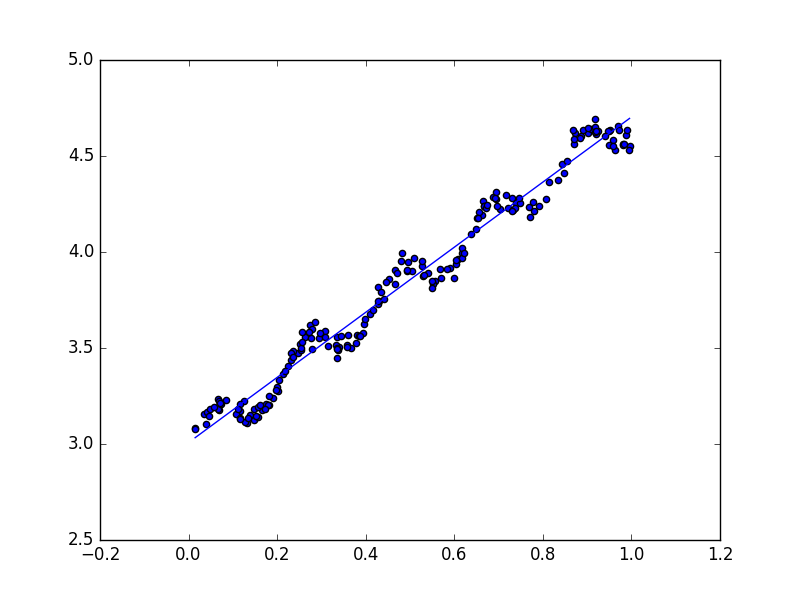
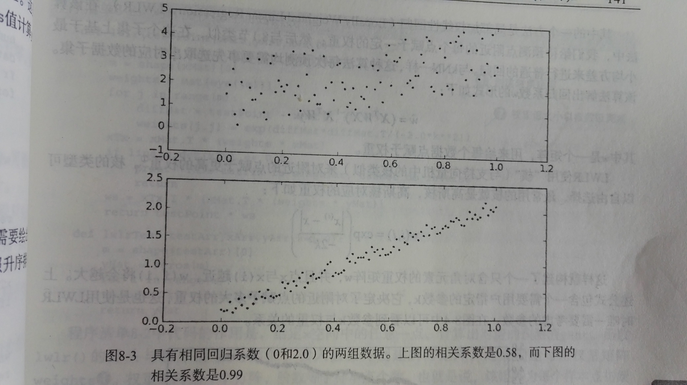
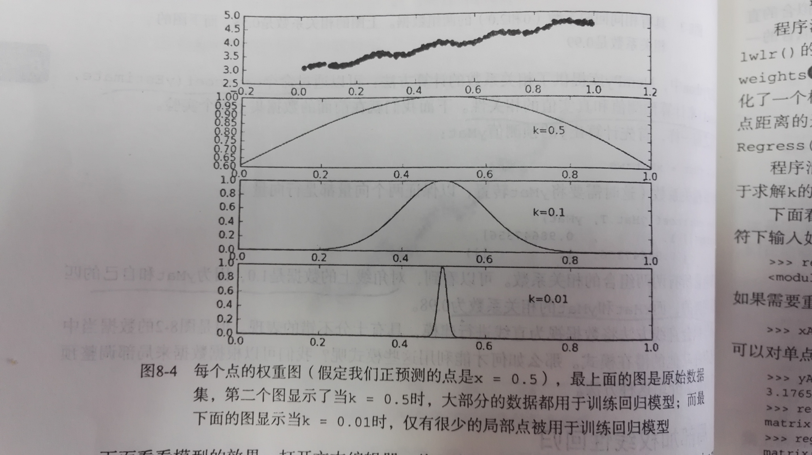
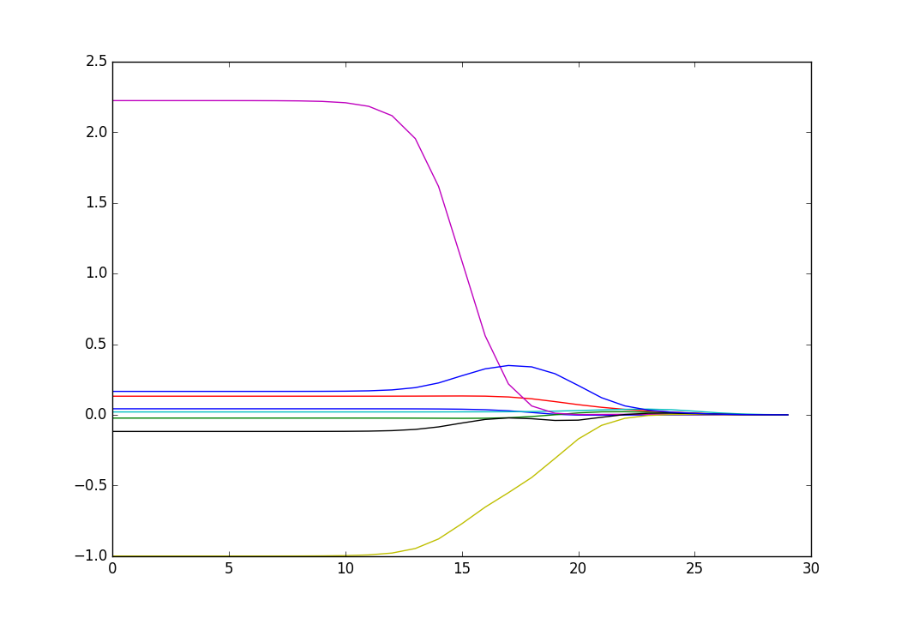

第8章 预测数值型数据：回归
=========================
回归与分类的**不同**：在于其目标变量是连续数值型，而分类的目标变量是标称型数据。

# 1 用线性回归找到最佳拟合直线

**线性回归**

**优点**：结果易于理解，计算上不复杂。

**缺点**：对非线性的数据拟合不好。

**适用数据范围**：数值型和标称型数据。

**回归目的**: 预测数值型的目标值，最直接的办法是依据输入样本数据输出一个目标值的计算公式。

假如你要预测姐姐男友汽车的功率大小，可能会这么计算

    HorsePower = 0.0015*annualSalary(年薪) - 0.99*hoursListeningToPublicRadio(听广播时间)

这就是所谓的**回归方程(regression equation)**,其中0.0015与-0.99称作**回归系数(regression weights)**,求这些回归系数的过程就是**回归**。一旦有了回归系数，再给定输入时，直接用回归系统乘以输入值，再将结果全部加起来，就得到了**预测值**。

回归分为线性回归与非线性回归。一般我们使用线性回归，即可以将输入项分别乘以一些常量，再将结果加起来得到输出。非线性回归模型则认为输出可能是输入的乘积.

    HorsePower = 0.0015*annualSalary(年薪)/hoursListeningToPublicRadio

回归的一般方法

    1. 收集数据： 采用任意方法收集数据
    
    2. 准备数据：回归需要数值型数据，标称型数据将被转成二值型数据。

    3. 分析数据：给出数据的可视化二维图将有助于对数据做出理解和分析，在采用缩减法求得新回归系数之后，可以将新拟合线绘在图上作为对比。

    4. 训练算法：找到回归系数。

    5. 测试算法：使用$R^2$或者预测值和数据的拟合度，来分析模型的效果。

    6. 使用算法：使用回归，可以在给定输入的时候预测出一个数值，这是对分类方法的提升，因为这样可以预测连续型数据而不仅仅是离散的类别标签。


怎么求回归方程？假定输入数据存放在矩阵$X$中，而回归系数存放在向量$w$中。那么对于给定的数据$X_1$,预测结果将会通过$Y_1 = X^{T}_{1}w$给出。现在问题是通过$X$与对应$Y$,怎样找到$w$呢?一个常用的方法就是找出使误差最小的$w$.这里误差是指预测y值和真实y值之间的差值，因为误差有正负，若直接相加可能会相互抵消，所以我们使用平方误差。

平方误差可以写做：
$$\sum_{i=1}^{m} (y_i - x_{i}^{T}w)^2$$
用矩阵表示还可以写做$(y-Xw)^{T}(y-Xw)$。如果对$w$求导，得到
$$\frac{\partial {\sum_{i=1}^{m} (y_i - x_{i}^{T}w)^2}}{\partial w} = -2\sum_{i=1}^{m} (y_i - x_{i}^{T}w)x_{i}^{T} = -2X^T(Y - Xw)$$
令其等于0，求极值，解出w如下：
$$ \hat{w} = (X^TX)^{-1}X^Ty $$
这里$\hat{w}$表示最优解，最佳估计。值得注意的是，上述公式中包含$(X^TX)^{-1}$,也就是对矩阵求逆,这个方程只在逆矩阵存在时适用。因此需要在代码中先进行判断是否存在逆矩阵。这种解法就叫做**最小二乘解**。

补充说明，求线性方程组的解，矩阵方程Xw=y
    $$x_{11}w_1 + x_{12}w_2 + ... + x_{1n}w_n = y_1$$
    $$x_{21}w_1 + x_{22}w_2 + ... + x_{2n}w_n = y_2$$
                    $$ . $$
                    $$ . $$
                    $$ . $$
    $$x_{m1}w_1 + x_{m2}w_2 + ... + x_{mn}w_n = y_m$$

如果$X$有逆矩阵（X为n*n矩阵，且秩为n,n个行向量两两线性不相关），则方程组的解为$w = X^{-1}y$。如果X没有逆矩阵，则该方程组或者没有解，或者有无穷多个解。

当逆矩阵不存在时，我们仍然想找出该方程组的最好解，意味着找出自变量的最好线性组合来预测因变量。使用线性代数的术语，我们想找到尽可能接近向量y的向量Xw;换句话说，我们希望最小化向量y - Xw的长度|| y - Xw||最小。这称作**最小二乘(least square)问题**,可以证明，方程$Xw=y$的最小二乘解是$w = (X^TX)^{-1}X^Ty$

下面来介绍如何给出该数据的最佳拟合直线。

在程序文件regression.py中增加如下代码
```python
import numpy as np

def loadDataSet(filename):
    dataMat = []; labelMat = []
    with open(filename, 'r') as fp: 
        for line in fp.readlines():
            lineAttr = line.strip().split()
            
            dataMat.append([float(attr) for attr in lineAttr[:-1]]) # 由于python数组index是以0开始，样本文件第一列都为1.0，即x0等于1.0，第二列的值为x1
            labelMat.append(float(lineAttr[-1]))
    return dataMat, labelMat

def standRegres(xArr, yArr):
    '''
    使用普通最小二乘法，来计算最佳拟合直线
    '''
    xMat = np.mat(xArr); yMat = np.mat(yArr).T
    xTx = xMat.T * xMat
    
    if np.linalg.det(xTx) == 0.0: #计算行列式，判断是否有逆矩阵。若没检查行列式是否为0就直接计算矩阵的逆，将会出现错误。另外Numpy的线性代数库还提供一个函数来解未知矩阵，修改ws = xTx.I * (xMat.T * yMat)为ws = np.linalg.solve(xTx, xMat.T*yMat)
        print "This matrix is singular , cannot do inverse"
        return
    
    ws = xTx.I * (xMat.T * yMat) # ws存放回归系数
    return ws

>>> xArr , yArr = loadDataSet('ex0.txt')
>>> xArr[0:2]
[[1.0, 0.067732], [1.0, 0.42781]]  #第一列都为1.0，即x0等于1.0，第二列的值为x1
>>> yArr[0:2]
[3.176513, 3.816464]

>>> ws = standRegres(xArr, yArr)
>>> ws # ws存放回归系数,在用内积预测y的时候，第一维将乘以前面的常数X0,第二维乘以输入变量X1。因为x0=1.0,所以y=ws[0] + ws[1] * x1.
matrix([[ 3.00774324],
        [ 1.69532264]])

```

现在绘出数据集散点图与最佳拟合直线图。y=ws[0] + ws[1] * x1.为预测值。为了和真实的y值区分开，将预测值计为yHat。
```python
def plotRegress():
    import matplotlib.pyplot as plt
    fig = plt.figure()
    ax = fig.add_subplot(111)
    
    xArr , yArr = loadDataSet('ex0.txt')
    xMat = np.mat(xArr); yMat = np.mat(yArr)
    
    ws = standRegres(xArr, yArr)
    #回归函数，用于预测
    yHat = xMat*ws
    
    #绘出数据集散点图
    ax.scatter(xMat[:,1].flatten().A[0], yMat.T[:,0].flatten().A[0])
     
    xCopy = xMat.copy()
    xCopy.sort(0)
    yHat = xCopy*ws
    ax.plot(xCopy[:,1], yHat)
    plt.show()

```
$$最佳拟合直线$$


 几乎任一数据集都可以用上述方法建立模型，那么，如何判断这些模型的好坏呢？如下两个数据集散点图，具有相同的回归系统（0和2.0），上图的相关系数是0.58，下图的相关系数是0.99.


有种方法可以计算预测值yHat与真实值y序列的匹配程度，那就是计算这两个序列的相关系数。Numpy库中提供了相关系数的计算方法：通过函数corrcoef(yEstimate, yActual)来计算预测值yHat与真实值y序列的相关性。
```python
>>> yHat = xMat*ws #回归函数，用于预测
>>> np.corrcoef(yHat.T, yMat) #由于yHat是列向量，进行转置，以保证两个向量都是行向量。
array([[ 1.        ,  0.98647356],
       [ 0.98647356,  1.        ]])
```

可以看到输出矩阵包含所有两两组合的相关系数。对角线上的数据是1.0，因为yMat和自己的匹配就最完美的，而yHat与yMat的相关系数为0.98.

最佳拟合直线方法将数据视为直线进行建模，具在十分不错的表现。但最佳拟合直线.png的数据当中似乎还存在其他的潜在模式。那么如何才能利用这些模式呢？我们可以根据数据来局部调整预测，下面就介绍这种方法。

# 2 局部加权线性回归

线性回归可能会出现**欠拟合现象**，因为它求的是具有最小均方误差的无偏估计。当出现欠拟合现象时，模型将不能取得最好的预测效果。有些方法允许在估计中引入一些偏差，从而降低预测的均方误差。

其中一种方法是**局部加权线性回归(Locally Weighted Linear Regression, LWLR)**.在此算法中，我们给待预测点附近的每个点赋予一定的权重；然后与8.1节类似，在这个子集上基于最小均方差来进行普通的回归。与kNN一样，这种算法每次预测均需要事先选取出对应的数据子集。(**与kNN一样，该加权模型认为样本点距离越近，越可能符合同一个线性模型**)。该算法解出回归系数w的形式如下：
$$ \hat{w} = (X^TWX)^{-1}X^TWy $$
其中$W$是一个矩阵，用来给每个数据点赋予权重。

LWLR使用 **“核”(与支持向量机中的核类似)** 来对附近的点赋予更高的权重。核的类型可以自由选择，最常用的核就是 **高斯核** ，高斯核对应的权重如下： exp 是指数函数$exp(x) = e^x$
$$ w(i,i) = \exp\left ( \frac{\left | x_{(i)}-x \right |}{-2k^2} \right ) $$

这样就构建了一个只含对角元素的权重矩阵$W$,并且点x与x(i)越近，w(i, i)将会越大。上述公式包含一个需要用户指定的参数k，它决定了对附近的点赋予多大权重，这也是使用LWLR时唯一需要考虑的参数。下图可以看到参数k与权重的关系。



上图是每个点的权重图（假定我们正预测的点是x=0.5）,最上面的图是原始数据集，第二个图显示了当k=0.5时，大部分的数据都用于训练回归模型；而最下面图显示当k=0.01时，仅有很少的局部点被用于训练回归模型。即当k越大时，w(i,i)越大，也就是权限越大。

程序清单 局部加权线性回归函数
```python
def lwlr(testPoint , xArr , yArr ,k=1.0):
    '''
        局部加权线性回归函数
        testPoint: 待预测的点，单条记录
        xArr: 样本特征
        yArr: 样本标签值
        k默认为1.0
    '''
    xMat = np.mat(xArr); yMat = np.mat(yArr).T
    m = np.shape(xMat)[0] #样本数
    weights = np.mat(np.eye((m)))  #创建对角矩阵,生成m*m单位矩阵
    
    for j in range(m):
        diffMat = testPoint - xMat[j,:]   #  diffMat * diffMat.T  就是两个样本点之间距离的平方
        weights[j,j] = np.exp(diffMat * diffMat.T / (-2.0 * k**2)) #权重值大小以指数级衰减
    
    xTx = xMat.T * (weights * xMat)
    
    if np.linalg.det(xTx) == 0.0: #计算行列式，判断是否有逆矩阵。若没检查行列式是否为0就直接计算矩阵的逆，将会出现错误。另外Numpy的线性代数库还提供一个函数来解未知矩阵，修改ws = xTx.I * (xMat.T * yMat)为ws = np.linalg.solve(xTx, xMat.T*yMat)
        print "This matrix is singular , cannot do inverse"
        return
    ws = xTx.I * (xMat.T * (weights * yMat))
    
    return testPoint * ws


def lwlrTest(testArr , xArr, yArr, k=1.0):
    '''
    局部加权线性回归函数
        testArr: 待预测的点，多条记录
        xArr: 样本特征
        yArr: 样本标签值
        k默认为1.0
    '''
    m = np.shape(testArr)[0] #待预测测试样本个数
    yHat = np.zeros(m)
    
    for i in range(m):
        yHat[i] = lwlr(testArr[i], xArr, yArr, k)
    
    return yHat

def plotLwlrRegress():
    '''
    画出局部加权线性回归函数生成的回归直线
    '''
    import matplotlib.pyplot as plt
    plt.figure(u"局部加权线性回归函数,使用不同的k值[1.0, 0.01, 0.003]") #图的title
    
    plt.subplot(311) #311表明，整个图分为三行一列，此时在第一行内画图
    
    xArr , yArr = loadDataSet('ex0.txt')
    xMat = np.mat(xArr); yMat = np.mat(yArr)
    
    srtInd = xMat[:,1].argsort(0)
    xSort = xMat[srtInd][:, 0,:]
    
    yHat = lwlrTest(xArr , xArr, yArr, k=1.0)
    plt.plot(xSort[:,1], yHat[srtInd])

    plt.scatter(xMat[:,1].flatten().A[0], np.mat(yArr).T.flatten().A[0], s=2, c='red')
    plt.text(0.5, 4.0, 'k=1.0', color='red', size=16, horizontalalignment='right', verticalalignment='bottom') #在线条边标注k值
    
    plt.subplot(312) #312表明，整个图分为三行一列，此时在第二行内画图
    yHat1 = lwlrTest(xArr , xArr, yArr, k=0.01)
    plt.plot(xSort[:,1], yHat1[srtInd])
    plt.scatter(xMat[:,1].flatten().A[0], np.mat(yArr).T.flatten().A[0], s=2, c='blue')
    plt.text(0.5, 4.0, 'k=0.01', color='red', size=16, horizontalalignment='right', verticalalignment='bottom')
    
    
    plt.subplot(313)
    yHat2 = lwlrTest(xArr , xArr, yArr, k=0.003)
    plt.plot(xSort[:,1], yHat2[srtInd])
    plt.scatter(xMat[:,1].flatten().A[0], np.mat(yArr).T.flatten().A[0], s=2, c='green')   
    plt.text(0.5, 4.0, 'k=0.003', color='red', size=16, horizontalalignment='right', verticalalignment='bottom')
    
    
    plt.show()


# 这里可以看出w与k成正相关。
>>> diffMat * diffMat.T
matrix([[ 0.12965617]])
>>> np.exp(diffMat * diffMat.T / (-2.0 * 0.01**2))
matrix([[  2.85241443e-282]])
>>> np.exp(diffMat * diffMat.T / (-2.0 * 0.1**2))
matrix([[ 0.00152951]])
>>> np.exp(diffMat * diffMat.T / (-2.0 * 0.5**2))
matrix([[ 0.771582]])
>>> np.exp(diffMat * diffMat.T / (-2.0 * 1.0**2))
matrix([[ 0.93722858]])


#当k分别取1.0和0.001时,求对应的预测值
>>> yArr[0]
3.176513
>>> lwlr(xArr[0], xArr, yArr, 1.0)
matrix([[ 3.12204471]])
>>> lwlr(xArr[0], xArr, yArr, 0.001)
matrix([[ 3.20175729]])


#画出局部加权线性回归函数生成的回归直线
>>> plotLwlrRegress()
```

如下图所示k取不同值[1.0, 0.01, 0.003],局部加权线性回归函数与样本散点之间关系效果图。**当K=1.0时，权重很大，如同将所有的数据视为等权重，得出的最佳拟合直线与标准的回归一致**。使用k=0.01得到了非常好的效果，抓住了数据的潜在模式。下图使用k=0.003纳入了太多噪声点，拟合的直线与数据点过于贴近，出现**过拟合现象**。而第一个图则**欠拟合**。下一节讨论对过拟合与欠拟合进行量化分析。

![局部加权线性回归函数\,使用不同的k值\[1.0\,_0.01\,_0.003\].png](局部加权线性回归函数\,使用不同的k值\[1.0\,_0.01\,_0.003\].png)

局部加权线性回归也存在一个问题：**增加了计算量，因为它对每个点做预测时都必须使用整个数据集**。上图可以看出，**k=0.01时估计比较好，但同时也存在大多数据点的权重都接近0**.如果避免这些计算,将可以减少程序运行时间，从而缓解因计算量增加带来的问题。


# 3 示例：预测鲍鱼的年龄
文件abalone.txt记录了鲍鱼的年龄，鲍鱼的年龄可以从鲍鱼壳的导数推算得到。
```python
def rssError(yArr , yHatArr):
    '''
    计算预测值与真实值之间的误差，平方和
    '''
    return ((yArr - yHatArr)**2).sum()
        
def abaloneTest():
    '''
    使用LWLR预测鲍鱼的年龄
    '''
    xArr , yArr = loadDataSet('abalone.txt')
    yHat01 = lwlrTest(xArr[0:99], xArr[0:99], yArr[0:99], 0.1)
    yHat1 = lwlrTest(xArr[0:99], xArr[0:99], yArr[0:99], 1)
    yHat10 = lwlrTest(xArr[0:99], xArr[0:99], yArr[0:99], 10)

    print rssError(yArr[0:99], yHat01.T) #56.8041972556
    print rssError(yArr[0:99], yHat1.T)  #429.89056187
    print rssError(yArr[0:99], yHat10.T) #549.118170883    
```
通过计算rssError预测值与真实值之间的误差，**发现当核k取较小的值时误差较低**。那么,为什么不在所有数据集上都使用最小的核呢？**这是因为使用最小的核将造成过拟合，对新数据不一定能达到最好的预测效果**。下面就来看在新数据上的表现。

```python
    yHat01 = lwlrTest(xArr[100:199], xArr[0:99], yArr[0:99], 0.1)
    yHat1 = lwlrTest(xArr[100:199], xArr[0:99], yArr[0:99], 1)
    yHat10 = lwlrTest(xArr[100:199], xArr[0:99], yArr[0:99], 10)
    
    print rssError(yArr[100:199], yHat01.T) #106085.423168
    print rssError(yArr[100:199], yHat1.T)  #573.52614419
    print rssError(yArr[100:199], yHat10.T) #517.571190538   
```
可以看到核大小等于10时测试误差最小，但它在训练集上的误差却是最大的。接下来再和简单的线性回归做个比较：
```python
    ws = standRegres(xArr[0:99], yArr[0:99])
    yHat = np.mat(xArr[100:199]) * ws
    print rssError(yArr[100:199], yHat.T.A) #518.636315325 
```
简单的线性回归达到了与局部加权线性回归类似的效果。这说明，必须在未知数据上比较效果才能选取到最佳模型，那么最佳的核大小是10吗？或许是，但如果想得到更好的效果，应该用10个不同的样本集做10次测试来比较结果。

本例展示了如何使用局部加权线性回归来构建模型，可以得到比普通线性回归更好的效果。局部加权线性回归的**问题**在于：每次必须在整个数据集上运行。也就是说为了做出预测，必须保存所有的训练数据。下面介绍另一种提高预测精度的方法，并分析安的优势所在。

# 4 缩减系数来“理解”数据
如果数据的特征n比样本点m还多(n > m), 也就是说输入数据的矩阵x不是满秩，在计算$(X^TX)^{-1}$时会出错，因此不能使用之前的方法进行线性回归。

为了解决这个问题，统计学家引入了 **岭回归(ridge regression)** 的概念，这就是本节将介绍的第一种缩减方法.接着是lasso法，该方法效果很好但计算复杂。本节最后介绍第二种缩减方法-- **前向一逐步回归** 可以得到与lasso差不多的效果，且更容易实现。

## 4.1 岭回归

简单说，岭回归就是在矩阵$X^TX$上加一个$\lambda I$,从而使得矩阵非奇异，进而能对$X^TX + \lambda I$求逆，其中矩阵$I$是一个m*m的单位矩阵，对角线上元素全是1，其它无事全是0.而$\lambda $是一个用户定义的数值。在这种情况下，回归系数的计算公式将变成

$$ \hat{w} = (X^TX + \lambda I)^{-1}X^Ty $$

岭回归最先用来处理特征数多于样本数的情况，现在也用于在估计中加入偏差，从而得到更好的估计。 **这里通过引入$\lambda $来限制所有w之和，通过引入该惩罚项，能够减少不重要的参数** ， 这个技术在统计学中也叫做 **缩减（shrinkage）**.

缩减方法可以去掉不重要的参数，因此能更好的理解数据。此外，与简单的线性回归相比缩减方法能取得更好的预测效果。

**通过预测误差最小化求得$\lambda $:数据获取之后，首先抽取一部分数据作为测试，剩余的作为训练集用于训练参数w。训练完毕后在测试集上测试预测性能。通过选取不同的$\lambda $来重复上述测试过程，最终得到一个使预测误差最小的$\lambda $。**

```python
#岭回归
    
def ridgeRegres(xMat, yMat, lam=0.2):
    '''
    岭回归缩减方法,用于计算回归系数
    xMat:样本特征
    yMat: 样本标签值
    lam: lambda值，默认为0.2
    '''
    xTx = xMat.T * xMat
    denom = xTx + np.eye(np.shape(xMat)[1]) * lam #  np.eye(np.shape(xMat)[1])生成一个特征个数n*特征个数n的单位矩阵
    
    if np.linalg.det(denom) == 0.0: #计算行列式，判断是否有逆矩阵。若没检查行列式是否为0就直接计算矩阵的逆，将会出现错误。另外Numpy的线性代数库还提供一个函数来解未知矩阵，修改ws = xTx.I * (xMat.T * yMat)为ws = np.linalg.solve(xTx, xMat.T*yMat)
        print "This matrix is singular , cannot do inverse"
        return
    ws = denom.I * (xMat.T * yMat)
    return ws

def ridgeTest(xArr , yArr):
    '''
    测试岭回归缩减方法，通过使用不同的lambda值
    '''
    xMat = np.mat(xArr); yMat = np.mat(yArr).T
    
    #下面进行特征数据的归一化标准处理，使每个维具有相同的重要性
    yMean = np.mean(yMat,0) #计算yMat，类型的平均值
    yMat = yMat - yMean
    
    #所有特征都减去各自的均值，并除以方差。
    xMeans = np.mean(xMat , 0) #计算每个特征的平均值
    xVar = np.var(xMat, 0) #计算指定轴上的方差。0表示二维数组中计算a11、a21、a31、……、am1的方差， 依此类推
    xMat = (xMat - xMeans) / xVar
    
    numTestPts = 30 #使用30个lambda值进行测试，且lambda值是以指数变化。这样可以看出lambda在取非常小与非常大的值时分别对结果造成的影响。
    wMat = np.zeros((numTestPts, np.shape(xMat)[1])) #生成一个30*特征个数的0矩阵
    
    for i in range(numTestPts):
        ws = ridgeRegres(xMat, yMat, lam= np.exp(i - 10))
        wMat[i] = ws.T
    return wMat

def plotRidge():
    '''
    画出30组指数变化的lambda值生成的岭回归直线
    '''
    import matplotlib.pyplot as plt
    fig = plt.figure(u"30组指数变化的lambda值生成的岭回归直线") #图的title
    
    ax = fig.add_subplot(111) #311表明，整个图分为三行一列，此时在第一行内画图
    
    xArr , yArr = loadDataSet('abalone.txt')
    ridgeWeights = ridgeTest(xArr, yArr)    
    
    ax.plot(ridgeWeights)
    plt.show()


>>> plotRidge()
```

运行后生成下图，该图绘出了回归系数与$log(\lambda )$的关系。在最左边，即$\lambda $最小时，可以得到所有系数的原始值（与线性回归一致）;而右边，系数全部缩减成0；在中间部分的某值将可以取得最好的预测效果。为了定量地找出最佳参数值，还需要进行交叉验证。



还有一些其它缩减方法，如lasso、LAR、PCA回归以及子集选择等。与岭回归一样，这些方法不仅可以提高预测精确率，而且可以解释回归系数。下面将介绍lasso方法。


# 4.2 lasso方法

