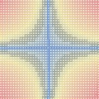

第10章 利用K-均值聚类算法对未标注数据分组
==========================================
聚类是一种**无监督的学习**，它将相似的对象归到同一个簇中。簇内的对象越相似，聚类效果越好。本章介绍K-均值（K-means）聚类算法，它可发现k个不同的簇，且每个簇的中心采用簇中所含值的均值计算而来。

**聚类与分类最大的不同**：分类的目标事先已知，而聚类则未知。

K-均值聚类算法：

**优点**：容易实现。

**缺点**：可能收敛到局部最小值，在大规模数据集上收敛较慢。

**适用数据范围**：数值型数据。

# 1 解决问题场景

K-Means算法主要解决的问题如下图所示。我们可以看到，在图的左边有一些点，我们用肉眼可以看出来有四个点群，但是我们怎么通过计算机程序找出这几个点群来呢？于是就出现了我们的K-Means算法

K-Means 要解决的问题

# 2 算法概要

这个算法其实很简单，如下图所示：

从上图中，我们可以看到，**A, B, C, D, E 是五个在图中点。而灰色的点是我们的种子点，也就是我们用来找点群的点**。有两个种子点，所以K=2。

然后，K-Means的算法如下：

1. 随机在图中取K（这里K=2）个种子点（这里是两个灰色的点）。
2. 然后对图中的所有点求到这K个种子点的距离，假如点$P_i$离种子点$S_j$最近，那么$P_i$属于$S_j$点群。（上图中，我们可以看到A,B属于上面的种子点，C,D,E属于下面中部的种子点）
3. 接下来，我们要移动种子点到属于他的“点群”的中心。（见图上的第三步）
4. 最后重复第2）和第3）步，直到种子点不再移动（我们可以看到图中的第四步上面的种子点聚合了A,B,C，下面的种子点聚合了D，E）。

这个算法很简单，但是有些细节要提一下，**求距离的公式(也就是相异度计算)**。

## 2.1 相异度计算（求距离的公式）

设 $ X = \left \{ x_1,x_2,...,x_n\right \} $, $ Y = \left \{ y_1,y_2,...,y_n\right \} $ ,其中X,Y是两个不同对象，各自拥有n个可度量的特征属性，那么X和Y的相异度定义为 $d\left ( X,Y \right ) = f\left ( X,Y \right ) \rightarrow R$ ，其中R为实数域。下面介绍不同类型变量相异度计算方法。

**欧几里得距离**:
$$d\left ( X,Y \right ) = \sqrt{\left ( x_1 - y_1 \right )^2 + \left ( x_2 - y_2 \right )^2 +... + \left ( x_n - y_n \right )^2 }  $$

**曼哈顿距离**:
$$ d\left ( X,Y \right ) =\left | x_1 - y_1 \right | + \left | x_2 - y_2 \right | +...+  \left | x_n - y_n \right | $$

**闵可夫斯基距离**:
$$ d\left ( X,Y \right ) = \sqrt[p]{\left ( x_1 - y_1 \right )^p + \left ( x_2 - y_2 \right )^p +... + \left ( x_n - y_n \right )^p }  $$

欧氏距离和曼哈顿距离可以看做是闵可夫斯基距离在p=2和p=1下的特例。另外这三种距离都可以加权，这个很容易理解，不再赘述。

下面要说一下标量的**规格化问题**。上面这样计算相异度的方式有一点问题，就是**取值范围大的属性对距离的影响高于取值范围小的属性**。为了平衡各个属性对距离的影响,通常将各个属性均映射到[0,1]区间，映射公式为：
$${a_i}' = \frac{a_i - \min (a_i)}{\max (a_i) -  \min (a_i)}$$

## 2.2 求点群中心的算法

一般来说，求点群中心点的算法你可以很简的使用各个点的X/Y坐标的平均值。不过，我这里想告诉大家另三个求中心点的的公式：

1) **平均值公式**：
$$ \bar{x} = \frac{x_1 + x_2 + ... + x_n}{n} $$
$$ \bar{y} = \frac{y_1 + y_2 + ... + y_n}{n} $$

2) **Minkowski Distance 公式** —— λ 可以随意取值，可以是负数，也可以是正数，或是无穷大。
$$d_{ij} = \sqrt[\lambda ]{\sum_{k=1}^{n}\left | x_{ik} -x_{jk} \right |^\lambda } $$

3) **Euclidean Distance 公式** —— 也就是第一个公式 λ=2 的情况
$$ d_{ij} = \sqrt{\sum_{k=1}^{n}\left | x_{ik} -x_{jk} \right |^2 } $$

4) **CityBlock Distance 公式** —— 也就是第一个公式 λ=1 的情况
$$d_{ij} = \sum_{k=1}^{n}\left | x_{ik} -x_{jk} \right |$$

这三个公式的求中心点有一些不一样的地方，我们看下图（对于第一个 λ 在 0-1之间）。

Minkowski Distance                        | Euclidean Distance | CityBlock Distance
----------------------------------------- | ------------------- | -------------------
 |  | 

$$ \left \{ x,y,z \right \} $$
