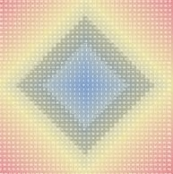

第10章 利用K-均值聚类算法对未标注数据分组
==========================================
聚类是一种**无监督的学习**，它将相似的对象归到同一个簇中。簇内的对象越相似，聚类效果越好。本章介绍K-均值（K-means）聚类算法，它可发现k个不同的簇，且每个簇的中心采用簇中所含值的均值计算而来。

**聚类与分类最大的不同**：分类的目标事先已知，而聚类则未知。

K-均值聚类算法：

**优点**：容易实现。

**缺点**：可能收敛到局部最小值，在大规模数据集上收敛较慢。

**适用数据范围**：数值型数据。

# 1 解决问题场景

K-Means算法主要解决的问题如下图所示。我们可以看到，在图的左边有一些点，我们用肉眼可以看出来有四个点群，但是我们怎么通过计算机程序找出这几个点群来呢？于是就出现了我们的K-Means算法


K-Means 要解决的问题

# 2 算法概要

这个算法其实很简单，如下图所示：


从上图中，我们可以看到，**A, B, C, D, E 是五个在图中点。而灰色的点是我们的种子点，也就是我们用来找点群的点**。有两个种子点，所以K=2。

然后，K-Means的算法如下：

1. 随机在图中取K（这里K=2）个种子点（这里是两个灰色的点）。
2. 然后对图中的所有点求到这K个种子点的距离，假如点$P_i$离种子点$S_j$最近，那么$P_i$属于$S_j$点群。（上图中，我们可以看到A,B属于上面的种子点，C,D,E属于下面中部的种子点）
3. 接下来，我们要移动种子点到属于他的“点群”的中心。（见图上的第三步）
4. 最后重复第2）和第3）步，直到种子点不再移动（我们可以看到图中的第四步上面的种子点聚合了A,B,C，下面的种子点聚合了D，E）。

这个算法很简单，但是有些细节要提一下，**求距离的公式(也就是相异度计算)**。

## 2.1 相异度计算（求距离的公式）

设 $ X = \left \{ x_1,x_2,...,x_n\right \} $, $ Y = \left \{ y_1,y_2,...,y_n\right \} $ ,其中X,Y是两个不同对象，各自拥有n个可度量的特征属性，那么X和Y的相异度定义为 $d\left ( X,Y \right ) = f\left ( X,Y \right ) \rightarrow R$ ，其中R为实数域。下面介绍不同类型变量相异度计算方法。

**欧几里得距离**:
$$d\left ( X,Y \right ) = \sqrt{\left ( x_1 - y_1 \right )^2 + \left ( x_2 - y_2 \right )^2 +... + \left ( x_n - y_n \right )^2 }  $$

**曼哈顿距离**:
$$ d\left ( X,Y \right ) =\left | x_1 - y_1 \right | + \left | x_2 - y_2 \right | +...+  \left | x_n - y_n \right | $$

**闵可夫斯基距离**:
$$ d\left ( X,Y \right ) = \sqrt[p]{\left ( x_1 - y_1 \right )^p + \left ( x_2 - y_2 \right )^p +... + \left ( x_n - y_n \right )^p }  $$

欧氏距离和曼哈顿距离可以看做是闵可夫斯基距离在p=2和p=1下的特例。另外这三种距离都可以加权，这个很容易理解，不再赘述。

下面要说一下标量的**规格化问题**。上面这样计算相异度的方式有一点问题，就是**取值范围大的属性对距离的影响高于取值范围小的属性**。为了平衡各个属性对距离的影响,通常将各个属性均映射到[0,1]区间，映射公式为：
$${a_i}' = \frac{a_i - \min (a_i)}{\max (a_i) -  \min (a_i)}$$


## 2.2 求点群中心的算法

一般来说，求点群中心点的算法你可以很简的使用各个点的X/Y坐标的平均值。不过，我这里想告诉大家另三个求中心点的的公式：

1) **平均值公式**：
$$ \bar{x} = \frac{x_1 + x_2 + ... + x_n}{n} $$
$$ \bar{y} = \frac{y_1 + y_2 + ... + y_n}{n} $$

2) **Minkowski Distance 公式** —— λ 可以随意取值，可以是负数，也可以是正数，或是无穷大。
$$d_{ij} = \sqrt[\lambda ]{\sum_{k=1}^{n}\left | x_{ik} -x_{jk} \right |^\lambda } $$

3) **Euclidean Distance 公式** —— 也就是第一个公式 λ=2 的情况
$$ d_{ij} = \sqrt{\sum_{k=1}^{n}\left | x_{ik} -x_{jk} \right |^2 } $$

4) **CityBlock Distance 公式** —— 也就是第一个公式 λ=1 的情况
$$d_{ij} = \sum_{k=1}^{n}\left | x_{ik} -x_{jk} \right |$$

这三个公式的求中心点有一些不一样的地方，我们看下图（对于第一个 λ 在 0-1之间）。

(1) Minkowski Distance                    | (2) Euclidean Distance | (3) CityBlock Distance
----------------------------------------- | ------------------- | -------------------
 |  | 

上面这几个图的大意是他们是怎么个逼近中心的，**第一个图以星形的方式，第二个图以同心圆的方式，第三个图以菱形的方式**。

## 2.3 K-means算法实现
创建KMeans.py文件，先增加K-均值聚类支持函数
```python
#!/usr/bin/env python
# encoding=utf8

import numpy as np

def loadDataSet(filename):
    '''
    从文件中加载数据
    '''
    dataMat = []
    with open(filename, 'r') as fp:
        for line in fp.readlines():
            curLine = line.strip().split('\t')
            fltLine = map(float, curLine)
            dataMat.append(fltLine)
    return dataMat

def distEclud(vecA , vecB):
    '''
    距离计算公式，相异度计算，这里选用欧几里得距离
    '''
    return np.sqrt(np.sum(np.power(vecA - vecB , 2))) # 欧几里得距离

def randCent(dataSet, k):
    '''
    从dataSet中随机选择k个质心，质心必须要在整个数据集的边界之内。
    这里通过找到数据集中每一维的最小和最大值来完成。然后生成0~1之间的随机数 乘以 维范围，以确保随机点在数据的边界之内。
    '''
    n = np.shape(dataSet)[1] #列数、特征个数
    centroids = np.mat(np.zeros((k,n)))
    
    for j in range(n):
        minJ = np.min(dataSet[:,j])  #特征J列最小值
        rangeJ = np.max(dataSet[:,j]) - minJ
        centroids[:,j] = minJ + rangeJ * np.random.rand(k, 1)   # np.random.rand(k, 1) 生成k个0~1之间的随机数
    return centroids
    


>>> dataMat = np.mat(loadDataSet('testSet.txt'))    
>>> np.min(dataMat[:,1])
-4.2325860000000004
>>> np.min(dataMat[:,0])
-5.3797129999999997
>>> randCent(dataMat, 2)
matrix([[ 0.77578934,  2.88560484],
        [-5.05754113,  4.14571695]])
>>> distEclud(dataMat[0], dataMat[1])
5.184632816681332

>>> np.random.rand(4, 1)
array([[ 0.74215908],
       [ 0.3339263 ],
       [ 0.28940638],
       [ 0.04805735]])

```
如上，所有支持函数均工作正常，下面开始实现完整的K-均值算法。先创建k个质心，然后将每个点分配到最近到质心，再重新计算质心。整个过程迭代多次，直到数据点的簇分配结果不再改变为止。

```python
def kMeans(dataSet, k, distMeas = distEclud, createCent=randCent):
    '''
    K-均值聚类算法。k为簇的数目，distMeas距离公式，createCent质心选择算法
    '''
    m = np.shape(dataSet)[0]
    clusterAssment = np.mat(np.zeros((m,2))) #簇分配结果矩阵，包含两列，第一列记录簇索引值，第二列存储误差（指当前点到簇质心的距离，
    #后面会使用这个误差来评价聚类的效果）。
    
    centroids = createCent(dataSet, k)
    clusterChanged = True #标志变量，是否继续迭代
    
    while clusterChanged:
        clusterChanged = False
        for i in range(m):
            minDist = np.inf; minIndex = -1
            
            for j in range(k):
                distJI = distEclud(dataSet[i,:], centroids[j,:]) # 计算点i到质心j的距离
                if distJI < minDist: #寻找最近的质心
                    minDist = distJI
                    minIndex = j
            if clusterAssment[i,0] != minIndex:
                clusterChanged = True
                clusterAssment[i,:] = minIndex, minDist**2  #簇分配结果矩阵,存储簇索引值与误差
        print centroids
        
        #待一轮原始数据都找到对应质心后，然后遍历所有质心并重新计算簇质心位置，最后继续下一轮迭代
        for cent in range(k):
            #先通过数组过滤来获得给定簇的所有点，然后计算所有点的均值，选项axis =0表示沿矩阵的列方向进行均值计算；最后，程序返回所有的类质心与点分配结果。
            ptsInClust = dataSet[np.nonzero(clusterAssment[:,0].A == cent)[0]] #.A 将matrix转换成array; np.nonzero()返回的是非0值的索引数组
            #dataSet[[2,3,4]] 返回第2，3，4行
            centroids[cent,:] = np.mean(ptsInClust, axis=0) #沿矩阵的列方向计算平均值，最终输出一行多列。若axis=1，最终输出多行一列
    return centroids, clusterAssment


>>> myCentroids, clusterAssing = kMeans(dataMat, 4) # 迭代5轮
[[-0.51370032  0.06094998]
 [-0.26905699  0.15430158]
 [ 1.17454355  4.17031088]
 [-1.07360784  0.30230069]]

[[-0.28093075 -3.880518  ]
 [ 3.03713839 -2.62802833]
 [ 2.1037747   3.1883033 ]
 [-3.14916123 -0.17600851]]

[[-1.53903612 -3.5993315 ]
 [ 3.03713839 -2.62802833]
 [ 1.98283629  3.1465235 ]
 [-3.27444433  0.16422313]]

[[-2.86821747 -3.16321911]
 [ 3.03713839 -2.62802833]
 [ 1.98283629  3.1465235 ]
 [-2.949973    1.90701079]]

[[-3.38237045 -2.9473363 ]
 [ 2.80293085 -2.7315146 ]
 [ 2.6265299   3.10868015]
 [-2.46154315  2.78737555]]

#.A 将matrix转换成array
>>> clusterAssment[:,0]
matrix([[ 2.],
        [ 1.],
        [ 3.],
        [ 0.],
        [ 1.],
>>> np.shape(clusterAssment[:,0])
(80, 1)
>>> np.shape(clusterAssment[:,0].A)
(80, 1)
>>> clusterAssment[:,0].A
array([[ 2.],
       [ 1.],
       [ 3.],
       [ 0.],
       [ 1.],
       [ 0.],
       [ 3.],

>>> clusterAssment[:,0].A == cent
array([[False],
       [False],
       [False],
       [ True],
       [False],
       [ True],
       [False],
>>> np.nonzero(clusterAssment[:,0].A == cent)
(array([ 3,  5,  7, 11, 14, 19, 23, 27, 29, 31, 35, 39, 43, 47, 51, 55, 59,
       63, 67, 71, 75, 79]), array([0, 0, 0, 0, 0, 0, 0, 0, 0, 0, 0, 0, 0, 0, 0, 0, 0, 0, 0, 0, 0, 0]))

>>> np.mean(ptsInClust, axis=0)  #沿矩阵的列方向计算平均值，最终输出一行多列。若axis=1，最终输出多行一列
matrix([[ 3.05350329,  2.07347767]])
```


## 2.4 使用后处理来提高聚类性能
簇数目K是用户预定义的参数，如何才能知道k的选择是正确的？下面讨论聚类的质量。

如下，当选择簇数目K=3时的聚类结果示意图：


可以发现点的分配结果没有那么准确。k-均值算法收敛但聚类效果较差的原因是，**k-均值算法收敛到了局部最小值，而非全局最小值**。一种度量**聚类效果的指标是SSE( Sum of Squared Error,误差平方和)**，SSE值越小表示数据点越接近于它们的质心，聚类效果越好。簇越多，SSE越小，但我们目标是保持簇数目不变的情况下提高簇的质量。

后处理，将具有最大SSE值的簇划分成两个簇；合并最近的质心，或者合并两个使得SSE增幅最小的质心。


## 2.5 二分K-均值算法
为克服K-均值算法收敛到局部最小值。二分K-均值算法先将所有点作为一个簇，然后一分为二，之后选择其中一个簇继续划分，以最大程序减小SSE的值。不断重复，直到得到用户指定的簇数目为止。

二分K-均值算法的伪代码：
```code
将所有点看成一个簇
当簇数目小于k时
对于每一个簇
	计算总误差
	在给定的簇上面进行K-均值聚类（k=2）
	计算将该簇一分为二后的总误差
选择使得误差最小的那个簇进行划分操作
```

```python
def biKmeans(dataSet, k ,distMeas = distEclud):
    '''
    二分K-均值算法
    '''
    m = np.shape(dataSet)[0]
    clusterAssment = np.mat(np.zeros((m,2)))
    centroid0 = np.mean(dataSet, axis=0).tolist()[0] # 计算原数据的质心，也就是所有数据的均值
    centList = [centroid0] #用于存储所有质心点
    
    for j in range(m):
        clusterAssment[j,1] = distEclud(dataSet[j, :], np.mat(centroid0)) ** 2
    
    while len(centList) < k :
        lowestSSE  = np.inf  #无穷大infinite, 无穷小-inf
        
        for i in range(len(centList)): #对每个簇划分成两个子簇，并计算其SSE误差。比较所有划分，选出一个SSE减少最多的簇划分，作为本次迭代的最优划分。
            ptsInCurrClusser = dataSet[np.nonzero(clusterAssment[:,0].A == i)[0], :] #当前簇的所有数据
            centroidMat, splitClustAss = kMeans(ptsInCurrClusser, 2, distMeas) #划分成两个子簇
            
            sseSplit = np.sum(splitClustAss[:,1]) #计算两个子簇的SSE误差
            sseNotSplit = np.sum(clusterAssment[np.nonzero(clusterAssment[:,0].A !=i )[0] , 1]) #计算非此划分簇以外的数据的SSE误差
            
            if (sseSplit + sseNotSplit) <  lowestSSE:  #选择误差减小最多的簇划分
                bestCentToSplit = i
                bestNewCents = centroidMat
                bestClustAss = splitClustAss.copy()
                lowestSSE = sseSplit + sseNotSplit
                
        # bestClustAss作为本次迭代的最优划分，由于是k=2的子簇划分，其索引值取值0或1.
        # 以下两条代码是，更新索引值为总centList质心点数组是的序列号。
        bestClustAss[np.nonzero(bestClustAss[:,0].A == 1)[0], 0] = len(centList) #将子簇中索引为1的，修改成新的最大序列（质心点数组大小+1）
        bestClustAss[np.nonzero(bestClustAss[:,0].A == 0)[0],0] = bestCentToSplit #将子簇中索引为0的，修改成原簇对应的序列
        
        print 'the bestCentToSplit is: ', bestCentToSplit
        print 'the len of bestClustAss is: ', len(bestClustAss)
        
        centList[bestCentToSplit] = bestNewCents[0,:]  #对应上面bestClustAss的修改，0子簇使用原centList中的序列号
        centList.append(bestNewCents[1,:])  #对应上面bestClustAss的修改，1子簇在centList数组中新增加一个序列号
        
        clusterAssment[np.nonzero(clusterAssment[:,0].A == bestCentToSplit)[0], :] = bestClustAss  #修改新误差到clusterAssment中
        
    return centList, clusterAssment
                

>>> np.mean(dataSet, axis=0)
matrix([[-0.10361321,  0.0543012 ]])
>>> np.mean(dataSet, axis=0).tolist()
[[-0.10361321250000004, 0.05430119999999998]]
>>> np.mean(dataSet, axis=0).tolist()[0]
[-0.10361321250000004, 0.05430119999999998]


>>> dataMat2 = np.mat(loadDataSet('testSet2.txt'))
>>> myCentroids, clusterAssing = biKmeans(dataMat2,3)
>>> print myCentroids
>>> platKMeans(dataMat2, myCentroids, clusterAssing)

```
发现每次执行后结果不一样，聚类效果时好时坏。如下图所示

第一次执行                                                  | 第二次执行
----------------------------------------------------------- | ---------------------------------------------------
   | 


