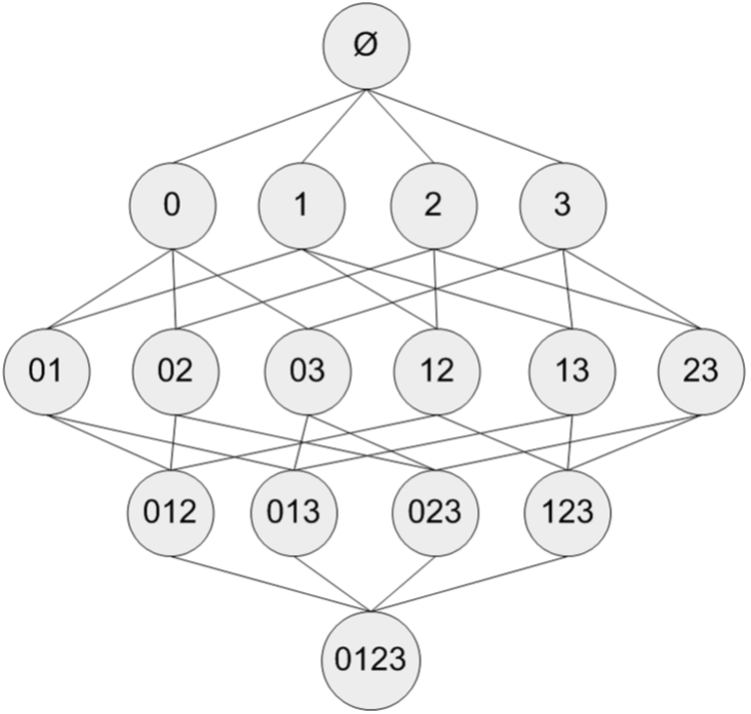
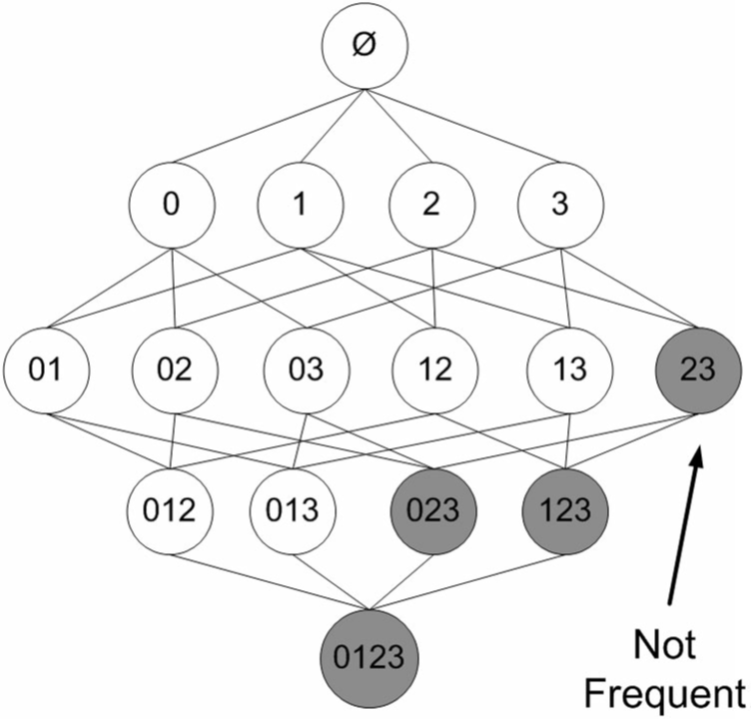
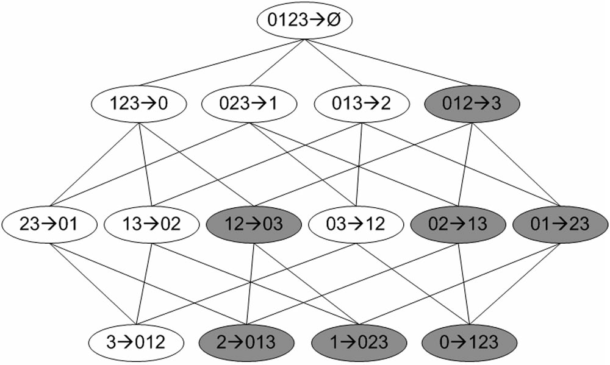

第11章 使用Apriori算法进行关联分析 
==========================================

从大规模数据集中寻找物品间的隐含关系被称作**关联分析（association analysis）**或者**关联规则学习（association rule learning）**。这里的主要问题在于，寻找物品的不同组合是一项十分耗时的任务，所需的计算代价很高，蛮力搜索方法并不能解决这个问题，所以需要用更智能的方法在合理的时间范围内找到频繁项集。

关联分析可以用于回答"哪些商品经常被同时购买？"之类的问题。书中举了一些关联分析的例子:

- 通过查看哪些商品经常在一起购买，可以帮助商店了解用户的购买行为。这种从数据海洋中抽取的知识可以用于商品定价、市场促销、存活管理等环节。

- 在美国国会投票记录中发现关联规则。在一个国会投票记录的数据集中发现议案投票的相关性，（原文：这里只是出于娱乐的目的，不过也可以……）使用分析结果来为政治竞选活动服务，或者预测选举官员会如何投票。

- 发现毒蘑菇的相似特征。这里只对包含某个特定元素（有毒性）的项集感兴趣，从中寻找毒蘑菇中的一些公共特征，利用这些特征来避免吃到那些有毒蘑菇。

- 在Twitter源中发现一些共现词。对于给定搜索词，发现推文中频繁出现的单词集合。

- 从新闻网站点击流中挖掘新闻流行趋势，挖掘哪些新闻广泛被用户浏览到。

- 搜索引擎推荐，在用户输入查询词时推荐同相关的查询词项。

# 1 关联分析

关联分析是在大规模数据集中寻找有趣关系的任务。这些关系可以有两种形式：

- 频繁项集

- 关联规则

**频繁项集（frequent item sets)** 是经常出现在一块儿的物品的集合，**关联规则（association rules)** 暗示两种物品之间可能存在很强的关系。

下面用一个例子来说明这两种概念：图1给出了某个杂货店的交易清单。

交易号码|    商品
------- | ------------
0       |  豆奶，莴苣
1       |  莴苣，尿布，葡萄酒，甜菜
2       |  豆奶，尿布，葡萄酒，橙汁
3       |  莴苣，豆奶，尿布，葡萄酒
4       |  莴苣，豆奶，尿布，橙汁

图1 某杂货店交易清单

**频繁项集是指那些经常出现在一起的商品集合**，图中的集合{葡萄酒,尿布,豆奶}就是频繁项集的一个例子。从这个数据集中也可以找到诸如尿布->葡萄酒的关联规则，即如果有人买了尿布，那么他很可能也会买葡萄酒。

我们用**支持度**和**可信度**来度量这些有趣的关系。一个**项集的支持度（support)**被定义数据集中包含该项集的记录所占的比例。如上图中，{豆奶}的支持度为4/5，{豆奶,尿布}的支持度为3/5。支持度是针对项集来说的，因此可以定义一个最小支持度，而只保留满足最小值尺度的项集。

**可信度或置信度（confidence）**是针对**关联规则**来定义的。规则{尿布}➞{啤酒}的可信度被定义为"支持度({尿布,啤酒})/支持度({尿布})"，由于{尿布,啤酒}的支持度为3/5，尿布的支持度为4/5，所以"尿布➞啤酒"的可信度为3/4。这意味着对于包含"尿布"的所有记录，我们的规则对其中75%的记录都适用。 **规则{尿布}➞{啤酒} 可理解为条件概率，已知在购买尿布的情况下，还购买啤酒的概率**。

# 2 Apriori原理
假设我们有一家经营着4种商品（商品0，商品1，商品2和商品3）的杂货店，2图显示了所有商品之间所有的可能组合：



图2 集合{0,1,2,3,4}中所有可能的项集组合

对于包含N中物品的数据集共有$2^N - 1$种项集组合，重复上述计算过程是不现实的。

研究人员发现一种所谓的**Apriori原理，可以帮助我们减少计算量**。**Apriori原理是说如果某个项集是频繁的，那么它的所有子集也是频繁的**。更常用的是它的逆否命题，即**如果一个项集是非频繁的，那么它的所有超集也是非频繁的**。

在图3中，已知阴影项集{2,3}是非频繁的。利用这个知识，我们就知道项集{0,2,3}，{1,2,3}以及{0,1,2,3}也是非频繁的。也就是说，一旦计算出了{2,3}的支持度，知道它是非频繁的后，就可以紧接着排除{0,2,3}、{1,2,3}和{0,1,2,3}。



图3 图中给出了所有可能的项集，其中非频繁项集用灰色表示。

# 3 使用Apriori算法来发现频繁集

前面提到，关联分析的目标包括两项：发现频繁项集和发现关联规则。首先需要找到频繁项集，然后才能获得关联规则（正如前文所讲，计算关联规则的可信度需要用到频繁项集的支持度）。

Apriori算法是发现频繁项集的一种方法。Apriori算法的两个输入参数分别是最小支持度和数据集。该算法首先会生成所有单个元素的项集列表。接着扫描数据集来查看哪些项集满足最小支持度要求，那些不满足最小支持度的集合会被去掉。然后，对剩下来的集合进行组合以生成包含两个元素的项集。接下来，再重新扫描交易记录，去掉不满足最小支持度的项集。该过程重复进行直到所有项集都被去掉。

# 3.1 生成候选项集
数据集扫描的伪代码大致如下：

```code
对数据集中的每条交易记录tran：
    对每个候选项集can：
        检查can是否是tran的子集
        如果是，则增加can的计数
对每个候选项集：
    如果其支持度不低于最小值，则保留该项集
返回所有频繁项集列表
```

下面看一下实际代码，建立一个apriori.py文件并加入一下代码：

```python
#!/usr/bin/env python
# encoding=utf8

import numpy as np

def loadDataSet():
    return [[1, 3, 4], [2, 3, 5], [1, 2, 3, 5], [2, 5]]

def createC1(dataSet):
    '''
    dataSet为全部数据集
    返回元素个数为1的项集,如每个单独商品(去重后)列表
    '''
    C1 = [] #C1即为元素个数为1的项集,如每个单独商品列表
    for transaction in dataSet:
        for item in transaction:
            if [item] not in C1:
                C1.append([item])
    C1.sort()
    C1 = map(frozenset ,C1)  # map(frozenset, C1)的语义是将C1由Python列表转换为不变集合（frozenset，Python中的数据结构）。
    #frozenset是不可变的，用户不能修改。这里使用frozenset是因为要将这些集合作为字典键值使用，使用frozenset可以实现，而set却做不到。
    return C1

def scanD(D, Ck , minSupport):
    '''
    D为全部数据集
    Ck为大小为k（包含k个元素）的候选项集
    minSupport为设定的最小支持度
    
    返回值中retList为在Ck中找出的频繁项集（支持度大于minSupport的），supportData记录各频繁项集的支持度。
    '''
    ssCnt = {} # 记录每个项集出现次数
    
    #统计每个项集出现次数
    for tid in D:
        for can in Ck:
            if can.issubset(tid):
                ssCnt[can] = ssCnt[can] + 1 if ssCnt.has_key(can) else 1
    
    numItems = float(len(D)) #全部数据集个数
    retList = []
    supportData = {}
    
    for key in ssCnt.iterkeys():
        support = ssCnt[key] / numItems
        if support >= minSupport:
            retList.insert(0,key) # 将频繁项集插入返回列表的首部。
        supportData[key] = support
    return retList, supportData


>>> dataSet = loadDataSet()
>>> dataSet
[[1, 3, 4], [2, 3, 5], [1, 2, 3, 5], [2, 5]]
>>> C1 = createC1(dataSet)
>>> C1
[frozenset([1]), frozenset([2]), frozenset([3]), frozenset([4]), frozenset([5])]
>>> D = map(set, dataSet)
>>> D
[set([1, 3, 4]), set([2, 3, 5]), set([1, 2, 3, 5]), set([2, 5])]
>>> L1, supportData0 = scanD(D, C1, 0.5)
>>> L1
[frozenset([1]), frozenset([3]), frozenset([2]), frozenset([5])]
>>> supportData0
{frozenset([4]): 0.25, frozenset([5]): 0.75, frozenset([2]): 0.75, frozenset([3]): 0.75, frozenset([1]): 0.5}

```

# 3.2 完整的Apriori算法
整个Apriori算法的伪代码如下：

```code
当集合中项的个数大于0时：
    构建一个由k个项组成的候选项集的列表（k从1开始）
    计算候选项集的支持度，删除非频繁项集
    构建由k+1项组成的候选项集的列表
```

程序代码如下：

```python

def aprioriGen(Lk , k):
    '''
    该函数通过频繁项集列表Lk(实际是Lk-1)和项集个数k生成候选项集Lk。
    k的大小等于LK中频繁项集中的项数+1，eg: k == len(lk[0]) + 1    

    注意其生成的过程中，首先对每个项集按元素排序，然后每次比较两个项集，只有在前k-1项相同时才将这两项合并。
    这样做是因为函数并非要两两合并各个集合，那样生成的集合并非都是k+1项的。在限制项数为k+1的前提下，只有在
    前k-1项相同、最后一项不相同的情况下合并才为所需要的新候选项集。

    由于Python中使用下标0表示第一个元素，因此代码中的[:k-2]的实际作用为取列表的前k-1个元素。
    
    '''
    retList = []
    lenLk = len(Lk)
    
    for i in range(lenLk):
        for j in range(i+1 , lenLk):
            # 若前k-2项相同时（也就是除了最后一项不相同，eg: abc与abe），将两个集合合并
            L1 = list(Lk[i])[:k-2]; L2 = list(Lk[j])[:k-2]
            L1.sort(); L2.sort()
            if L1 == L2:
                retList.append(Lk[i] | Lk[j])  # frozenset集合并操作
    return retList
    
def apriori(dataSet, minSupport=0.5):
    '''
    Apriori算法的主函数。
    
    Ck表示项数为k的候选项集，最初的C1通过createC1()函数生成。Lk表示项数为k的频繁项集，supK为其支持度，Lk和supK由scanD()函数通过Ck计算而来。
    
    函数返回的L和supportData为所有的频繁项集及其支持度，因此在每次迭代中都要将所求得的Lk和supK添加到L和supportData中。
    
    '''
    C1 = createC1(dataSet)
    D = map(set, dataSet)
    
    L1, supportData = scanD(D, C1, minSupport)
    
    L = [L1]
    k = 2
    
    while (len(L[k-2]) > 0):
        Ck = aprioriGen(L[k-2], k)
        Lk, supportDataK = scanD(D, Ck, minSupport)
        supportData.update(supportDataK)
        L.append(Lk)
        k +=1
    return L, supportData
    

>>> L, supportData = apriori(dataSet)
>>> L
[[frozenset([1]), frozenset([3]), frozenset([2]), frozenset([5])], [frozenset([1, 3]), frozenset([2, 5]), frozenset([2, 3]), frozenset([3, 5])], [frozenset([2, 3, 5])], []]
>>> supportData
{frozenset([5]): 0.75, frozenset([3]): 0.75, frozenset([2, 3, 5]): 0.5, frozenset([1, 2]): 0.25, frozenset([1, 5]): 0.25, frozenset([3, 5]): 0.5, frozenset([4]): 0.25, frozenset([2, 3]): 0.5, frozenset([2, 5]): 0.75, frozenset([1]): 0.5, frozenset([1, 3]): 0.5, frozenset([2]): 0.75}


# 至少75%的支持度 
>>> L, supportData = apriori(dataSet, 0.75)
>>> L
[[frozenset([3]), frozenset([2]), frozenset([5])], [frozenset([2, 5])], []]
>>> supportData
{frozenset([5]): 0.75, frozenset([3]): 0.75, frozenset([3, 5]): 0.5, frozenset([4]): 0.25, frozenset([2, 3]): 0.5, frozenset([2, 5]): 0.75, frozenset([1]): 0.5, frozenset([2]): 0.75}


```

# 3.3 从频繁集中挖掘相关规则

要找到关联规则，我们首先从一个频繁项集开始。从杂货店的例子可以得到，如果有一个频繁项集{豆奶, 莴苣}，那么就可能有一条关联规则“豆奶➞莴苣”。这意味着如果有人购买了豆奶，那么在统计上他会购买莴苣的概率较大。注意这一条反过来并不总是成立，也就是说，可信度(“豆奶➞莴苣”)并不等于可信度(“莴苣➞豆奶”)。

前文也提到过，一条规则P➞H的可信度定义为support(P | H)/support(P)，其中“|”表示P和H的并集。可见可信度的计算是基于项集的支持度的。

图4给出了从项集{0,1,2,3}产生的所有关联规则，其中阴影区域给出的是低可信度的规则。可以发现如果{0,1,2}➞{3}是一条低可信度规则，那么所有其他以3作为后件（箭头右部包含3）的规则均为低可信度的。



图4 从项集{0,1,2,3}产生的所有关联规则

可以观察到,**如果某条规则并不满足最小可信度要求，那么该规则的所有子集也不会满足最小可信度要求**。以图4为例，假设规则{0,1,2} ➞ {3}并不满足最小可信度要求，那么就知道任何左部为{0,1,2}子集的规则也不会满足最小可信度要求。可以利用关联规则的上述性质属性来减少需要测试的规则数目，类似于Apriori算法求解频繁项集。

关联规则生成函数

```python
def generateRules(L, supportData, minConf=0.7):
    '''
    关联规则生成函数
    
    3个参数：频繁项集列表L、包含那些频繁项集支持数据的字典supportData、最小可信度阈值minConf
    
    '''
    bigRuleList = []  #包含可信度的规则列表,后面可以基于可信度对它们进行排序。
    
    for i in range(1, len(L)): #i = 0时L[0]为单个频繁集,i表示当前遍历的频繁项集包含的元素个数。这里只获取有两个或更多元素的集合
        for freqSet in L[i]:  # freqSet为当前遍历的频繁项集
            H1 = [frozenset([item]) for item in freqSet] # 对每个频繁项集构建只包含单个元素集合的列表H1
            if i > 1:
                rulesFromConseq(freqSet, H1, supportData, bigRuleList, minConf)
            else:
                calcConf(freqSet, H1, supportData, bigRuleList, minConf) #只有两个元素的集合
    return bigRuleList

def calcConf(freqSet, H , supportData, brl, minConf=0.7):
    '''
    对规则进行评估。计算规则的可信度，并过滤出满足最小可信度要求的规则，最后将这个规则列表添加到主函数的bigRuleList中（通过参数brl）。
    
    freqSet: 为有n个元素的频率集
    H：为频率集中的n个元素或n个元素的两两或多个组合
    supportData: 支持集
    brl: 用于存储>可信度minConf的关联规则
    minConf: 最低可信度
    
    返回值prunedH保存规则列表的右部
    
    '''
    prunedH = []
    for conseq in H:
        conf = supportData[freqSet] / supportData[freqSet - conseq] #p(012->3) = p(0123 |012) = p(0123)/p(012)
        if conf >= minConf:
            print freqSet - conseq, ' ------> ', conseq, '   conf:', conf
            brl.append((freqSet - conseq, conseq, conf))
            prunedH.append(conseq)
    return prunedH
        
def rulesFromConseq(freqSet, H, supportData, brl, minConf=0.7):
    '''
    根据当前候选规则集H生成下一层候选规则集
    
    参数：频繁项集freqSet，可以出现在规则右部的元素列表H，supportData保存项集的支持度，brl保存生成的关联规则，minConf同主函数
    
    '''
    m = len(H[0]) #计算H中的频繁项集大小m
    if len(freqSet) > (m + 1):  # 查看该频繁项集是否大到可以移除大小为m的子集
        Hmpl = aprioriGen(H, m+1) # 使用函数aprioriGen()来生成H中元素的无重复组合
        Hmpl = calcConf(freqSet, Hmpl, supportData, brl, minConf)
        if len(Hmpl) > 1:
            rulesFromConseq(freqSet, Hmpl, supportData, brl, minConf)
  

>>> rules = generateRules(L, supportData, minConf=0.7)
frozenset([1])  ------>  frozenset([3])    conf: 1.0
frozenset([5])  ------>  frozenset([2])    conf: 1.0
frozenset([2])  ------>  frozenset([5])    conf: 1.0

>>> rules = generateRules(L, supportData, minConf=0.5)
frozenset([3])  ------>  frozenset([1])    conf: 0.666666666667
frozenset([1])  ------>  frozenset([3])    conf: 1.0
frozenset([5])  ------>  frozenset([2])    conf: 1.0
frozenset([2])  ------>  frozenset([5])    conf: 1.0
frozenset([3])  ------>  frozenset([2])    conf: 0.666666666667
frozenset([2])  ------>  frozenset([3])    conf: 0.666666666667
frozenset([5])  ------>  frozenset([3])    conf: 0.666666666667
frozenset([3])  ------>  frozenset([5])    conf: 0.666666666667
frozenset([5])  ------>  frozenset([2, 3])    conf: 0.666666666667
frozenset([3])  ------>  frozenset([2, 5])    conf: 0.666666666667
frozenset([2])  ------>  frozenset([3, 5])    conf: 0.666666666667
```

# 3.4 关于rulesFromConseq()函数的问题

# 3.4.1 问题

频繁项集L的值前面提到过。我们在其中计算通过{2, 3, 5}生成的关联规则，可以发现关联规则{3, 5}➞{2}和{2, 3}➞{5}的可信度都应该为1.0的，因而也应该包括在当minConf = 0.7时的rules中——但是这在前面的运行结果中并没有体现出来。minConf = 0.5时也是一样，{3, 5}➞{2}的可信度为1.0，{2, 5}➞{3}的可信度为2/3，{2, 3}➞{5}的可信度为1.0，也没有体现在rules中。

通过分析程序代码，我们可以发现：

- 当i = 1时，generateRules()函数直接调用了calcConf()函数直接计算其可信度，因为这时L[1]中的频繁项集均包含两个元素，可以直接生成和判断候选关联规则。比如L[1]中的{2, 3}，生成的候选关联规则为{2}➞{3}、{3}➞{2}，这样就可以了。
- 当i > 1时，generateRules()函数调用了rulesFromConseq()函数，这时L[i]中至少包含3个元素，如{2, 3, 5}，对候选关联规则的生成和判断的过程需要分层进行（图4）。这里，将初始的H1（表示初始关联规则的右部，即箭头右边的部分）作为参数传递给了rulesFromConseq()函数。

例如，对于频繁项集{a, b, c, …}，H1的值为[a, b, c, …]（代码中实际为frozenset类型）。如果将H1带入计算可信度的calcConf()函数，在函数中会依次计算关联规则{b, c, d, …}➞{a}、{a, c, d, …}➞{b}、{a, b, d, …}➞{c}……的支持度，并保存支持度大于最小支持度的关联规则，并保存这些规则的右部（prunedH，即对H的过滤，删除支持度过小的关联规则）。

当i > 1时没有直接调用calcConf()函数计算通过H1生成的规则集。在rulesFromConseq()函数中，首先获得当前H的元素数m = len(H[0])（记当前的H为$H_m$）。当$H_m$可以进一步合并为m+1元素数的集合$H_{m+1}$时（判断条件：len(freqSet) > (m + 1)），依次：

- 生成$H_{m+1}$：Hmpl = aprioriGen(H, m + 1)
- 计算$H_{m+1}$的可信度：Hmpl = calcConf(freqSet, Hmpl, …)
- 递归计算由$H_{m+1}$生成的关联规则：rulesFromConseq(freqSet, Hmpl, …)

所以这里的问题是，在i>1时，rulesFromConseq()函数中并没有调用calcConf()函数计算$H_1$的可信度，而是直接由H1生成H2，从H2开始计算关联规则——于是由元素数>3的频繁项集生成的{a, b, c, …}➞{x}形式的关联规则（图4中的第2层）均缺失了。由于代码示例数据中的对H1的剪枝prunedH没有删除任何元素，结果只是“巧合”地缺失了一层。正常情况下如果没有对H1进行过滤，直接生成H2，将给下一层带入错误的结果（如图4中的012➞3会被错误得留下来）。

# 3.4.2 对问题代码的修改

在i>1时，将对H1调用calcConf()的过程加上就可以了。比如可以这样：

```python
def generateRules2(L, supportData, minConf=0.7):
    '''
    关联规则生成函数
    
    3个参数：频繁项集列表L、包含那些频繁项集支持数据的字典supportData、最小可信度阈值minConf
    
    '''
    bigRuleList = []  #包含可信度的规则列表,后面可以基于可信度对它们进行排序。
    
    for i in range(1, len(L)): #i = 0时L[0]为单个频繁集,i表示当前遍历的频繁项集包含的元素个数。这里只获取有两个或更多元素的集合
        for freqSet in L[i]:  # freqSet为当前遍历的频繁项集
            H1 = [frozenset([item]) for item in freqSet] # 对每个频繁项集构建只包含单个元素集合的列表H1
            if i > 1:
                H1 = calcConf(freqSet, H1, supportData, bigRuleList, minConf) #只有两个元素的集合
                rulesFromConseq(freqSet, H1, supportData, bigRuleList, minConf)
            else:
                calcConf(freqSet, H1, supportData, bigRuleList, minConf) #只有两个元素的集合
    return bigRuleList


>>> rules = generateRules2(L, supportData, minConf=0.7)
frozenset([1])  ------>  frozenset([3])    conf: 1.0
frozenset([5])  ------>  frozenset([2])    conf: 1.0
frozenset([2])  ------>  frozenset([5])    conf: 1.0
frozenset([3, 5])  ------>  frozenset([2])    conf: 1.0 #比之前多了以下两条规则
frozenset([2, 3])  ------>  frozenset([5])    conf: 1.0
```

这里就只需要修改generateRules()函数。这样实际运行效果中，刚才丢失的那几个关联规则就都出来了。

进一步修改：当i=1时的else部分并没有独特的逻辑，这个if语句可以合并，然后再修改rulesFromConseq()函数，保证其会调用calcConf(freqSet, H1, …)：

进一步修改：消除rulesFromConseq2()函数中的递归项。这个递归纯粹是偷懒的结果，没有简化任何逻辑和增加任何可读性，可以直接用一个循环代替：

```python
def generateRules3(L, supportData, minConf=0.7):
    '''
    关联规则生成函数
    
    3个参数：频繁项集列表L、包含那些频繁项集支持数据的字典supportData、最小可信度阈值minConf
    
    '''
    bigRuleList = []  #包含可信度的规则列表,后面可以基于可信度对它们进行排序。
    
    for i in range(1, len(L)): #i = 0时L[0]为单个频繁集,i表示当前遍历的频繁项集包含的元素个数。这里只获取有两个或更多元素的集合
        for freqSet in L[i]:  # freqSet为当前遍历的频繁项集
            H1 = [frozenset([item]) for item in freqSet] # 对每个频繁项集构建只包含单个元素集合的列表H1
            rulesFromConseq2(freqSet, H1, supportData, bigRuleList, minConf)
    return bigRuleList

def rulesFromConseq2(freqSet, H, supportData, brl, minConf=0.7):
    '''
    根据当前候选规则集H生成下一层候选规则集
    
    参数：频繁项集freqSet，可以出现在规则右部的元素列表H，supportData保存项集的支持度，brl保存生成的关联规则，minConf同主函数
    
    '''
    m = len(H[0]) #计算H中的频繁项集大小m
    while len(freqSet) > m:  # 判断长度 > m，这时即可求H的可信度
        H = calcConf(freqSet, H, supportData, brl, minConf)
        
        if len(H) > 1: #判断求完可信度后是否还有可信度大于阈值的项用来生成下一层H
            H = aprioriGen(H, m+1) # 使用函数aprioriGen()来生成H中元素的无重复组合
            m += 1
        else: # 不能继续生成下一层候选关联规则，提前退出循环
            break

>>> rules = generateRules3(L, supportData, minConf=0.7)
frozenset([1])  ------>  frozenset([3])    conf: 1.0
frozenset([5])  ------>  frozenset([2])    conf: 1.0
frozenset([2])  ------>  frozenset([5])    conf: 1.0
frozenset([3, 5])  ------>  frozenset([2])    conf: 1.0
frozenset([2, 3])  ------>  frozenset([5])    conf: 1.0
```

另一个主要的区别是去掉了多余的Hmpl变量。运行的结果和generateRules2相同。

# 4  小结

关联分析是用于发现大数据集中元素间有趣关系的一个工具集，可以采用两种方式来量化这些有趣的关系。第一种方式是使用频繁项集，它会给出经常在一起出现的元素项。第二种方式是关联规则，每条关联规则意味着元素项之间的“如果……那么”关系。

发现元素项间不同的组合是个十分耗时的任务，不可避免需要大量昂贵的计算资源，这就需要一些更智能的方法在合理的时间范围内找到频繁项集。能够实现这一目标的一个方法是Apriori算法，它使用Apriori原理来减少在数据库上进行检查的集合的数目。Apriori原理是说如果一个元素项是不频繁的，那么那些包含该元素的超集也是不频繁的。Apriori算法从单元素项集开始，通过组合满足最小支持度要求的项集来形成更大的集合。支持度用来度量一个集合在原始数据中出现的频率。

关联分析可以用在许多不同物品上。商店中的商品以及网站的访问页面是其中比较常见的例子。

每次增加频繁项集的大小，Apriori算法都会重新扫描整个数据集。当数据集很大时，这会显著降低频繁项集发现的速度。下一章会介绍FP-growth算法，和Apriori算法相比，该算法**只需要对数据库进行两次遍历，能够显著加快发现频繁项集的速度**。


至此，一个完整的Apriori算法就完成了。
