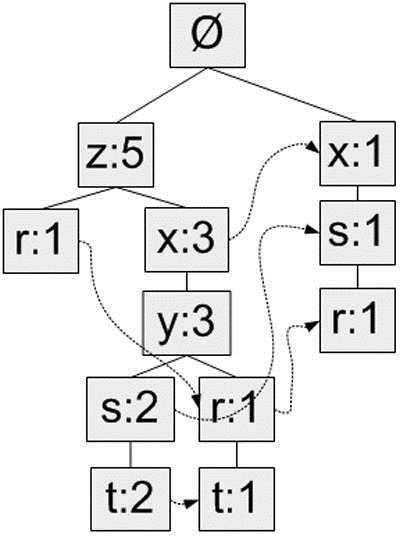
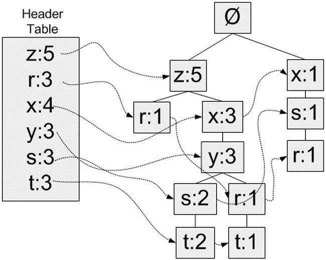
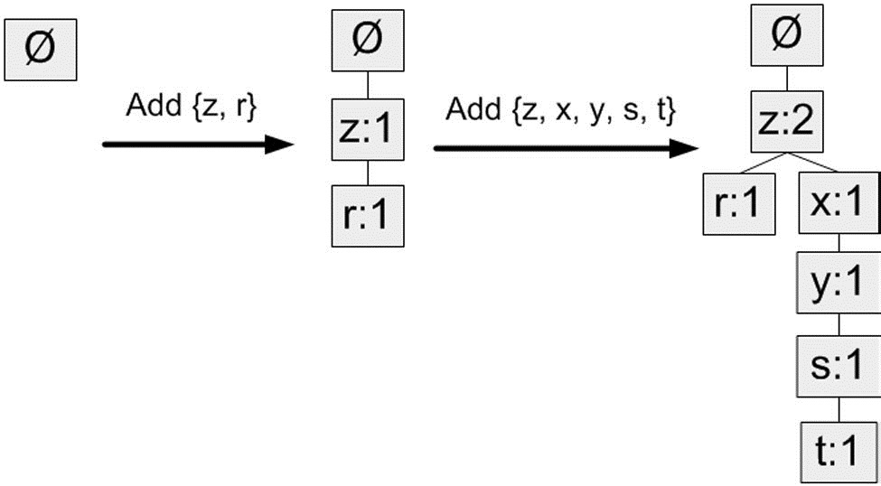
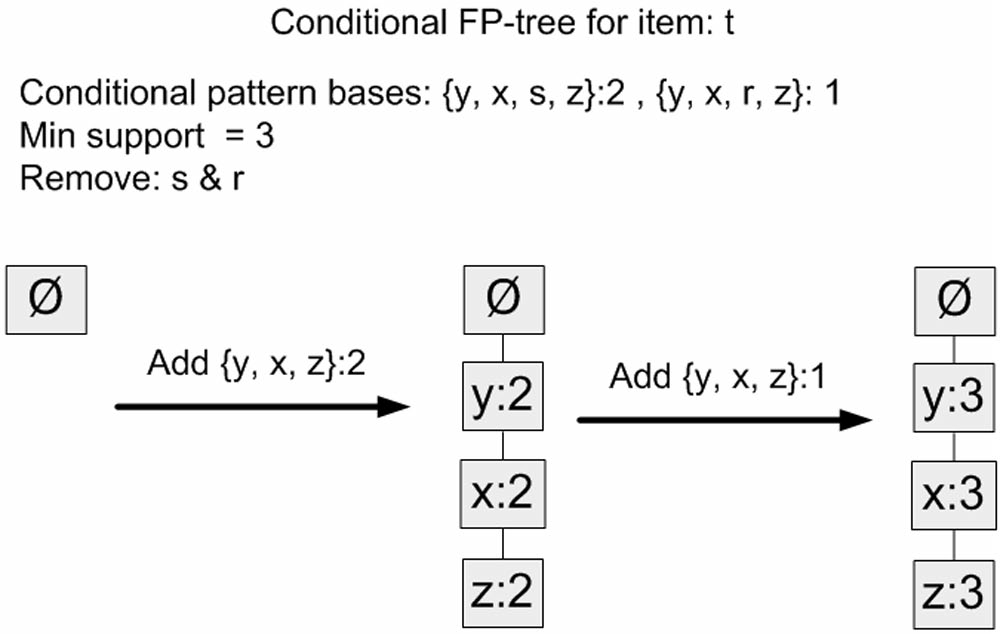
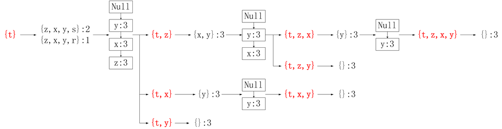

第12章 使用FP-growth算法来高效发现频繁项集
==========================================
FP-growth算法基于Apriori构建，但采用了高级的数据结构减少扫描次数，大大加快了算法速度。**FP-growth算法只需要对数据库进行两次扫描**，而Apriori算法对于每个潜在的频繁项集都会扫描数据集判定给定模式是否频繁，因此FP-growth算法的速度要比Apriori算法快,**通常性能要好两个数量级以上。这种算法虽然能更高效地发现频繁项集，但不能用于发现关联规则**。

FP-growth算法发现频繁项集的基本过程如下：

- 构建FP树
- 从FP树中挖掘频繁项集

**FP-growth算法**:

- **优点**：一般要快于Apriori。
- **缺点**：实现比较困难，在某些数据集上性能会下降。
- **适用数据类型**：离散型数据。

# 1 FP树：用于编码数据集的有效方式

FP-growth算法将数据存储在一种称为**FP树的紧凑数据结构**中。FP代表**频繁模式（Frequent Pattern）**。一棵FP树看上去与计算机科学中的其他树结构类似，但是它通过链接（link）来连接相似元素，被连起来的元素项可以看成一个链表。图1给出了FP树的一个例子。



图1 一棵FP树，和一般的树结构类似，包含着连接相似节点（值相同的节点）的连接

与搜索树不同的是，**一个元素项可以在一棵FP树种出现多次**。**FP树会存储项集的出现频率，而每个项集会以路径的方式存储在数中**。存在相似元素的集合会共享树的一部分。只有当集合之间完全不同时，树才会分叉。 树节点上给出集合中的单个元素及其在序列中的出现次数，路径会给出该序列的出现次数。

相似项之间的链接称为**节点链接（node link)**，用于快速发现相似项的位置。

举例说明，下表用来产生图1的FP树：

用于生成图1中FP树的事务数据样例

事务ID | 事务中的元素项
------ | -------------
001    | r, z, h, j, p
002    | z, y, x, w, v, u, t, s
003    | z
004    | r, x, n, o, s
005    | y, r, x, z, q, t, p
006    | y, z, x, e, q, s, t, m

**对FP树的解读**：

图1中，元素项z出现了5次，集合{r, z}出现了1次。于是可以得出结论：z一定是单独出现一次和其他符号一起出现了4次。集合{t, s, y, x, z}出现了2次，集合{t, r, y, x, z}出现了1次，z本身单独出现1次。就像这样，**FP树的解读方式是读取某个节点开始到根节点的路径。路径上的元素构成一个频繁项集，开始节点的值表示这个项集的支持度**。根据图1，我们可以快速读出项集{z}的支持度为5、项集{t, s, y, x, z}的支持度为2、项集{r, y, x, z}的支持度为1、项集{r, s, x}的支持度为1。FP树中会多次出现相同的元素项，也是因为同一个元素项会存在于多条路径，构成多个频繁项集。但是频繁项集的共享路径是会合并的，如图中的{t, s, y, x, z}和{t, r, y, x, z}

和之前一样，我们取一个最小阈值，出现次数低于最小阈值的元素项将被直接忽略。图1中将最小支持度设为3，所以q和p没有在FP中出现。

FP-growth算法的工作流程如下。首先构建FP树，然后利用它来挖掘频繁项集。为构建FP树，需要对原始数据集扫描两遍。第一遍对所有元素项的出现次数进行计数。数据库的第一遍扫描用来统计出现的频率，而**第二遍扫描中只考虑那些频繁元素**。

# 2 构建FP树

# 2.1 创建FP树的数据结构

由于树节点的结构比较复杂，我们使用一个类表示。创建文件fpGrowth.py并加入下列代码：

```python
ass treeNode:
    def __init__(self, nameValue, numOccur, parentNode):
        self.name = nameValue # 节点元素名称，在构造时初始化为给定值
        self.count = numOccur # 出现次数，在构造时初始化为给定值
        self.nodeLink = None  # 指向下一个相似节点的指针，默认为None
        self.parent = parentNode  # 指向父节点的指针，在构造时初始化为给定值
        self.children = {}    # 指向子节点的字典，以子节点的元素名称为键，指向子节点的指针为值，初始化为空字典
        
    def inc(self, numOccur):
        '''
        增加节点的出现次数值
        '''
        self.count += numOccur
        
    def disp(self, ind=1):
        '''
        输出节点和子节点的FP树结构
        '''
        print '  '*ind , self.name, ' ', self.count
        for child in self.children.values():
            child.disp(ind+1)

>>> rootNode = treeNode('pyramid', 9, None)
>>> rootNode.children['eye'] = treeNode('eye', 13, None)
>>> rootNode.children['phoenix'] = treeNode('phoenix', 3, None)
>>> rootNode.disp()
   pyramid   9
     eye   13
     phoenix   3

```

现在FP树所需要的数据结构已经建好，下面就可以构造FP树了。

# 2.2 构建FP树

**头指针表**

FP-growth算法还需要一个称为**头指针表的数据结构**，其实很简单，就是用来记录各个元素项的总出现次数的数组，再附带一个指针指向FP树中该元素项的第一个节点。这样每个元素项都构成一条单链表。图示说明：



图2 带头指针表的FP树，头指针表作为一个起始指针来发现相似元素项

这里使用Python字典作为数据结构，来保存头指针表。以元素项名称为键，保存出现的总次数和一个指向第一个相似元素项的指针。

第一次遍历数据集会获得每个元素项的出现频率，去掉不满足最小支持度的元素项，生成这个头指针表。

**元素项排序**

上文提到过，**FP树会合并相同的频繁项集（或相同的部分）**。因此为判断两个项集的相似程度需要对项集中的元素进行排序（不过原因也不仅如此，还有其它好处）。**排序基于元素项的绝对出现频率（总的出现次数）来进行**。在第二次遍历数据集时，会读入每个项集（读取），去掉不满足最小支持度的元素项（过滤），然后对元素进行排序（重排序）。

对示例数据集进行过滤和重排序的结果如下：

事务ID | 事务中的元素项 | 过滤(删除不满足最小支持度的元素hjpwvuonqem)及重排序后的事务
------ | -------------  | --------------------
001    | r, z, h, j, p	| z, r
002    | z, y, x, w, v, u, t, s	| z, x, y, s, t
003    | z              | z
004    | r, x, n, o, s  | x, s, r
005    | y, r, x, z, q, t, p | z, x, y, r, t
006    | y, z, x, e, q, s, t, m | z, x, y, s, t

**构建FP树**

在对事务记录过滤和排序之后，就可以构建FP树了。从空集开始，将过滤和重排序后的频繁项集一次添加到树中。如果树中已存在现有元素，则增加现有元素的值；如果现有元素不存在，则向树添加一个分支。对前两条事务进行添加的过程：



图3 FP树构建过程示意（添加前两条事务）

算法：构建FP树

```code
输入：数据集、最小值尺度
输出：FP树、头指针表
1. 遍历数据集，统计各元素项出现次数，创建头指针表
2. 移除头指针表中不满足最小值尺度的元素项
3. 第二次遍历数据集，创建FP树。对每个数据集中的项集：
    3.1 初始化空FP树
    3.2 对每个项集进行过滤和重排序
    3.3 使用这个项集更新FP树，从FP树的根节点开始：
        3.3.1 如果当前项集的第一个元素项存在于FP树当前节点的子节点中，则更新这个子节点的计数值
        3.3.2 否则，创建新的子节点，更新头指针表
        3.3.3 对当前项集的其余元素项和当前元素项的对应子节点递归3.3的过程
```

代码（在fpGrowth.py中加入下面的代码）：

```python
def createTree(dataSet, minSup=1):
    '''
    创建FP树
    dataSet：dataSet的格式比较奇特，不是直觉上得集合的list，而是一个集合的字典，以这个集合为键，值部分记录的是这个集合出现的次数。
    '''
    # 第一次遍历数据集，创建头指针表
    headerTable = {}
    for trans in dataSet:
        for item in trans:
            headerTable[item] = headerTable.get(item, 0) + dataSet[trans] # dataSet[trans] 为此数据集出现的次数，默认都为1
            
    # 移除不满足最小支持度的元素项
    for k in headerTable.keys():
        if headerTable[k] < minSup:
            del(headerTable[k])
    
    freqItemSet = set(headerTable.keys())
    # 空元素集，返回空
    if len(freqItemSet) == 0:
        return None, None

    # 增加一个数据项，用于存放指向相似元素项指针
    for k in headerTable:
        headerTable[k] = [headerTable[k] , None]
    
    retTree = treeNode('Null Set', 1, None) # 根节点
    
    # 第二次遍历数据集，创建FP树
    for tranSet , count in dataSet.items():
        localD = {} # 对一个项集tranSet，记录其中每个元素项的全局频率，用于排序
        for item in tranSet:
            if item in freqItemSet:
                localD[item] = headerTable[item][0] # 注意这个[0]，因为之前加过一个数据项
                
        if len(localD) > 0:
            orderedItems = [v[0] for v in sorted(localD.items(), key=lambda p: p[1], reverse=True)]  # 根据全局频率排序，频繁的在前面
            
            updataTree(orderedItems, retTree, headerTable, count) # 更新FP树
            
    return retTree, headerTable
            
    
def updataTree(items, inTree, headerTable, count):
    '''
    修改数结构与头指针表
    items：等待插入的数据项（已删除非频繁子项，且已按全局频率排序）
    inTree: 待插入到哪个树结点下
    headerTable: 头指针表 key---->[count, treeNode link]
    count: 数据项出现次数
    '''
    if items[0] in inTree.children:
        # 有该元素项时计数值+1
        inTree.children[items[0]].inc(count)
    else:
        # 没有这个元素项时创建一个新节点
        inTree.children[items[0]] = treeNode(items[0], count, inTree)
        # 更新头指针表或前一个相似元素项节点的指针指向新节点
        if headerTable[items[0]][1] == None:
            headerTable[items[0]][1] = inTree.children[items[0]]
        else: 
            updateHeader(headerTable[items[0]][1], inTree.children[items[0]])
            
    if len(items) >1 :
        # 对剩下的元素项迭代调用updateTree函数
        updataTree(items[1::], inTree.children[items[0]], headerTable, count)
        
def updateHeader(nodeToTest, targetNode):
    '''
    获取头指针表中该元素项对应的单链表的尾节点，然后将其指向新节点targetNode。
    '''
    while (nodeToTest.nodeLink != None):
        nodeToTest = nodeToTest.nodeLink
        
    nodeToTest.nodeLink = targetNode
        
```

需要注意的是，参数中的dataSet的格式比较奇特，不是直觉上得集合的list，而是一个集合的字典，以这个集合为键，值部分记录的是这个集合出现的次数。于是要生成这个dataSet还需要后面的createInitSet()函数辅助。因此代码中第7行中的dataSet[trans]实际获得了这个trans集合的出现次数（在本例中均为1），同样第21行的“for tranSet, count in dataSet.items():”获得了tranSet和count分别表示一个项集和该项集的出现次数。——这样做是为了适应后面在挖掘频繁项集时生成的条件FP树。

**生成数据集**：
```python
def loadSimpDat():
    simpDat = [['r', 'z', 'h', 'j', 'p'],
               ['z', 'y', 'x', 'w', 'v', 'u', 't', 's'],
               ['z'],
               ['r', 'x', 'n', 'o', 's'],
               ['y', 'r', 'x', 'z', 'q', 't', 'p'],
               ['y', 'z', 'x', 'e', 'q', 's', 't', 'm']]
    return simpDat

def createInitSet(dataSet):
    retDict = {}
    for trans in dataSet:
        retDict[frozenset(trans)] = 1
    return retDict

>>> simpDat = loadSimpDat()
>>> initSet = createInitSet(simpDat)
>>> myFPtree, myHeaderTable = createTree(initSet, 3)
>>> myFPtree.disp()
   Null Set   1
     x   1
       s   1
         r   1
     z   5
       x   3
         y   3
           s   2
             t   2
           r   1
             t   1
       r   1

```

得到的FP树也和图1中的一样。

# 3 从一棵FP树种挖掘频繁项集

有了FP树之后，就可以抽取频繁项集了。这里的思路与Apriori算法大致类似，首先从单元素项集合开始，然后在此基础上逐步构建更大的集合。

从FP树中抽取频繁项集的三个基本步骤如下：

- 从FP树中获得条件模式基；
- 利用条件模式基，构建一个条件FP树；
- 迭代重复步骤1步骤2，直到树包含一个元素项为止。

# 3.1 抽取条件模式基 conditional pattern base

首先从头指针表中的每个频繁元素项开始，对每个元素项，获得其对应的**条件模式基（conditional pattern base）**。**条件模式基是以所查找元素项为结尾的路径集合**。每一条路径其实都是一条前缀路径（prefix path）。简而言之，**一条前缀路径是介于所查找元素项与树根节点之间的所有内容**。

如图2，符号r的前缀路径是{x, s}、{z, x, y}、{z}。每一条前缀路径都与一个计数值关联，该计数值等于起始元素项的计数值。

则一个频繁元素项的所有前缀路径（条件模式基）为：

频繁项	| 前缀路径
------  | -----------
z	| {}: 5
r	| {x, s}: 1, {z, x, y}: 1, {z}: 1
x	| {z}: 3, {}: 1
y	| {z, x}: 3
s	| {z, x, y}: 2, {x}: 1
t	| {z, x, y, s}: 2, {z, x, y, r}: 1

z存在于路径{z}中，因此前缀路径为空，另添加一项该路径中z节点的计数值5构成其条件模式基；r存在于路径{r, z}、{r, y, x, z}、{r, s, x}中，分别获得前缀路径{z}、{y, x, z}、{s, x}，另添加对应路径中r节点的计数值（均为1）构成r的条件模式基；以此类推。

下面的程序给出了创建前缀路径的代码：

```python
def findPrefixPath(basePat, treeNode):
    '''
    创建前缀路径，给定元素项生成一个条件模式基（前缀路径），这通过访问树中所有包含给定元素项的节点来完成。
    
    参数basePet：输入的频繁项
    treeNode: 当前FP树种对应的第一个节点（可在函数外部通过headerTable[basePat][1]获取）
    
    函数返回值即为条件模式基condPats，用一个字典表示，键为前缀路径，值为计数值。
    '''
    condPats = {}
    while treeNode != None:
        prefixPath = []
        ascendTree(treeNode, prefixPath)
        if  len(prefixPath) >1 :
            condPats[frozenset(prefixPath[1:])] = treeNode.count
        treeNode = treeNode.nodeLink
    return condPats

def ascendTree(leafNode, prefixPath):
    '''
    函数直接修改prefixPath的值，将当前节点leafNode添加到prefixPath的末尾，然后递归添加其父节点。
    
    最终结果，prefixPath就是一条从treeNode（包括treeNode）到根节点（不包括根节点）的路径。在主函数findPrefixPath()中再取prefixPath[1:]，即为treeNode的前缀路径。
    '''
    if leafNode.parent != None:
        prefixPath.append(leafNode.name)
        ascendTree(leafNode.parent, prefixPath)


>>> print findPrefixPath('x', myHeaderTable['x'][1])
{frozenset(['z']): 3}
>>> print findPrefixPath('z', myHeaderTable['z'][1])
{}
>>> print findPrefixPath('r', myHeaderTable['r'][1])
{frozenset(['x', 's']): 1, frozenset(['z']): 1, frozenset(['y', 'x', 'z']): 1}

```

# 3.2 创建条件FP树

对于每一个频繁项，都要创建一棵条件FP树。可以使用刚才发现的条件模式基作为输入数据，并通过相同的建树代码来构建这些树。例如，对于r，即以“{x, s}: 1, {z, x, y}: 1, {z}: 1”为输入，调用函数createTree()获得r的条件FP树；对于t，输入是对应的条件模式基“{z, x, y, s}: 2, {z, x, y, r}: 1”。

代码（直接调用createTree()函数）：
```python
condPattBases = findPrefixPath(basePat, headerTable[basePat][1])
myCondTree, myHead = createTree(condPattBases, minSup)
```

示例：t的条件FP树



图4 t的条件FP树的创建过程

在图4中，注意到元素项s以及r是条件模式基的一部分，但是它们并不属于条件FP树。因为在当前的输入中，s和r不满足最小支持度的条件。

# 3.3 递归查找频繁项集

有了FP树和条件FP树，我们就可以在前两步的基础上递归得查找频繁项集。

递归的过程是这样的：

```python
输入：我们有当前数据集的FP树（inTree，headerTable）
1. 初始化一个空列表preFix表示前缀
2. 初始化一个空列表freqItemList接收生成的频繁项集（作为输出）
3. 对headerTable中的每个元素basePat（按计数值由小到大），递归：
        3.1 记basePat + preFix为当前频繁项集newFreqSet
        3.2 将newFreqSet添加到freqItemList中
        3.3 计算t的条件FP树（myCondTree、myHead）
        3.4 当条件FP树不为空时，继续下一步；否则退出递归
        3.4 以myCondTree、myHead为新的输入，以newFreqSet为新的preFix，外加freqItemList，递归这个过程

def mineTree(inTree, headerTable , minSup, preFix, freqItemList):
    '''
    参数：
    inTree和headerTable是由createTree()函数生成的数据集的FP树
    minSup表示最小支持度
    preFix请传入一个空集合（set([])），将在函数中用于保存当前前缀
    freqItemList请传入一个空列表（[]），将用来储存生成的频繁项集
    
    '''
    bigL =  [v[0] for v in sorted(headerTable.items(), key=lambda p: p[1])]  #  对headerTable中的每个元素basePat（按计数值由小到大排序）
    
    for basePat in bigL:
        newFreqSet = preFix.copy()
        newFreqSet.add(basePat)  #记basePat + preFix为当前频繁项集newFreqSet
        
        freqItemList.append(newFreqSet) 
        condPattBases = findPrefixPath(basePat, headerTable[basePat][1])
        
        myCondTree, myHead = createTree(condPattBases, minSup)
        
        if myHead != None:
            print 'conditional tree for: ', newFreqSet
            myCondTree.disp(1)
            mineTree(myCondTree, myHead, minSup, newFreqSet, freqItemList)

>>>  freqItems = []
>>> mineTree(myFPtree, myHeaderTable, 3, set([]), freqItems)
conditional tree for:  set(['y'])
   Null Set   1
     x   3
       z   3
conditional tree for:  set(['y', 'z'])
   Null Set   1
     x   3
conditional tree for:  set(['s'])
   Null Set   1
     x   3
conditional tree for:  set(['t'])
   Null Set   1
     y   3
       x   3
         z   3
conditional tree for:  set(['x', 't'])
   Null Set   1
     y   3
conditional tree for:  set(['z', 't'])
   Null Set   1
     y   3
       x   3
conditional tree for:  set(['x', 'z', 't'])
   Null Set   1
     y   3
conditional tree for:  set(['x'])
   Null Set   1
     z   3   

 
>>> print freqItems
[set(['y']), set(['y', 'x']), set(['y', 'z']), set(['y', 'x', 'z']), set(['s']), set(['x', 's']), set(['t']), set(['y', 't']), set(['x', 't']), set(['y', 'x', 't']), set(['z', 't']), set(['x', 'z', 't']), set(['y', 'x', 'z', 't']), set(['y', 'z', 't']), set(['r']), set(['x']), set(['x', 'z']), set(['z'])]

````

想这一段代码解释清楚比较难，因为中间涉及到很多递归。直接举例说明，我们在这里分解输入myFPtree和myHeaderTab后，“for basePat in bigL:”一行当basePat为’t’时的过程：



图中红色加粗的部分即实际添加到freqItemList中的频繁项集。

#3.4 封装

至此，完整的FP-growth算法已经可以运行。封装整个过程如下：

```python
def fpGrowth(dataSet, minSup=3):
    initSet = createInitSet(dataSet)
    myFPtree, myHeaderTab = createTree(initSet, minSup)
    freqItems = []
    mineTree(myFPtree, myHeaderTab, minSup, set([]), freqItems)
    return freqItems
```

注意，这里直接使用了上节（4.2）中的createInitSet()函数，这里有个问题：上节中的loadSimpDat()函数返回了一组简单的样例数据，没有相同的事务，所以createInitSet()函数中直接赋值“retDict[frozenset(trans)] = 1”没有问题。但是如果要封装成一个通用的FP-growth算法，就还需要处理输入数据有相同事务的情形，createInitSet()函数中需要累加retDict[frozenset(trans)]。


# 4 总结
FP-growth算法是一种用于发现数据集中频繁模式的有效方法。FP-growth算法利用Apriori原则，执行更快。Apriori算法产生候选项集，然后扫描数据集来检查它们是否频繁。由于只对数据集扫描两次，因此FP-growth算法执行更快。在FP-growth算法中，数据集存储在一个称为FP树的结构中。FP树构建完成后，可以通过查找元素项的条件基及构建条件FP树来发现频繁项集。该过程不断以更多元素作为条件重复进行，直到FP树只包含一个元素为止。

FP-growth算法还有一个map-reduce版本的实现，它也很不错，可以扩展到多台机器上运行。Google使用该算法通过遍历大量文本来发现频繁共现词，其做法和我们刚才介绍的例子非常类似（参见扩展阅读：FP-growth算法）。

# 5 扩展阅读

在看这两章的过程中和之后又看到的一些相关的东西：

- 尿布与啤酒：[http://web.onetel.net.uk/~hibou/Beer and Nappies.html](http://web.onetel.net.uk/~hibou/Beer%20and%20Nappies.html)
- Association Analysis: Basic Concepts and Algorithms[PDF](http://www-users.cs.umn.edu/~kumar/dmbook/ch6.pdf)
- FP-growth算法：H. Li, Y. Wang, D. Zhang, M. Zhang, and E. Chang, “PFP: Parallel FP-Growth for Query Recommendation,” RecSys 2008, Proceedings of the 2008 ACM Conference on Recommender Systems; http://portal.acm.org/citation.cfm?id=1454027.
- kosarak：Hungarian online news portal clickstream retrieved July 11, 2011; from Frequent Itemset Mining Dataset Repository, http://fimi.ua.ac.be/data/, donated by Ferenc Bodon.

注：

- 获取kosarak.dat文件，请参考文章目录：《机器学习实战》学习笔记。
- 如果需要在Python源代码中插入Unicode字符（汉字）注释最好在文件第一行添加“# coding=utf-8”。


